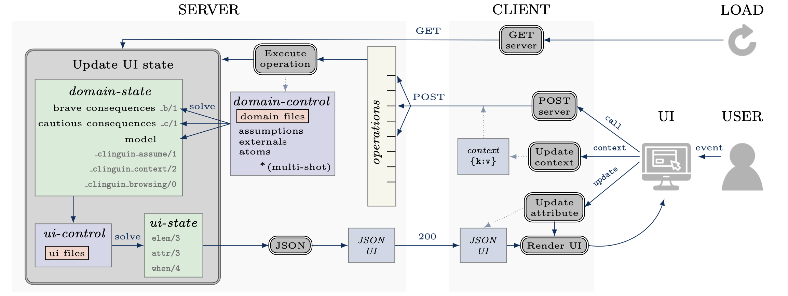

===============
Reference Guide
===============

This guide explains the internal workflow of `clinguin` and all its concepts.
The full workflow of the system is shown in the figure below.
This image displays the Client-Server architecture, where communication occurs via an HTTP protocol using JSON.
All components of the diagram are explained in detail in this guide and can be used as a reference.
In this diagram, operations are marked in gray, states corresponding to sets of facts are depicted in green, and input files appear in red.

------------------------------------------------------------------------------------

Structure
#########

******
Server
******

    The server is responsible for executing clingo and computing the information required to define the UI. This process unfolds in two distinct steps:

        1. The :ref:`domain-state` is computed using the domain-specific encodings difined in the :ref:`domain-files`. These information include user-selected atoms, potential selections, and inferred atoms.
        2. The server utilizes the provided UI encoding to generate the :ref:`ui-state`, defining the layout, style, and functionality of the interface.

    To allow flexibility, further separation is done to have interchangeable functionalities.

    **Backend**
    

        The part of the server that defines the control and functionality, allowing users to interact with the clingo control in different ways.
        It offers the option to define and overwrite operations, as well as customize how the UI is updated and the contextual information in the :ref:`domain-state`.
        Users can create their own Backend to increase functionality (:ref:`Creating your own backend`).
        
        We provide the following :ref:`Backends` with the system:

            * *ClingoBackend*: Basic clingo functionality using single-shot solving
            * *ClingoMultishotBackend*: clingo functionality using multi-shot solving
            * *ClingraphBackend*: ClingoMultishotBackend enhanced with the option to render and interact with Clingraph images
            * *ExplanationBackend*: ClingoMultishotBackend enhanced with explanation functionalities via Minimal Unsatisfiable Cores
            * *ClingoDLBackend*:  ClingoMultishotBackend enhanced with `clingod-dl <https://potassco.org/labs/clingoDL/>`_

******
Client
******

    The client is responsible for rendering the UI and responding to the user's actions.
    When it is loaded, it requests the :ref:`ui-state` from the server.
    Upon receiving the :ref:`ui-state` in JSON format (:ref:`JSON UI`), the client utilizes a front-end language to render the corresponding UI.

    To allow flexibility, further separation is done to have interchangeable UIs and functionalities.

    **Frontend**

        The part of the client that generates the layout based on the :ref:`JSON UI` and displays the UI.  Users can create their own Frontend to have a different view (:ref:`Creating your own frontend`).  
        
        We provide the following :ref:`Frontends` with the system:

            * *AngularFrontend*: UI using Angular to generate a web interface 
            * *TkinterFrontend*: UI using Tkinter an OS-dependent interface

------------------------------------------------------------------------------------

Input
#####

************
domain-files
************

    The domain-specific ASP encodings that will generate solutions to the problem (including the instance).
    These files will be used by the :ref:`domain-control`.
    They are provided when starting the server via the command line in argument ``--domain-files``.

************
ui-files
************

    The encoding that will generate the :ref:`ui-state` using the :ref:`domain-state` as input.
    They are provided when starting the server via the command line in argument ``--ui-files``.
    

------------------------------------------------------------------------------------

State
#####

States are sets of ASP facts that are used to define diferent aspects of the system.

********
ui-state
********

    A User Interface is defined in `clinguin` using the three predicates below.
    These facts are generated by calling clingo with the :ref:`domain-state` and the provided :ref:`ui-files`.

    .. note::
        The available element types, attributes, events, and actions will vary depending on the frontend. See the details for each front end in the :ref:`Frontends` section.

    * ``elem(ID, TYPE, PARENT)``

        Elements define building blocks of the UI.

        * ``ID`` Identifies the element for further references.

        * ``TYPE`` The type of element (``window``, ``container``, ``button`` etc).

        * ``PARENT`` The id of the parent element. The identifier ``root`` is used as the root element of the UI.

    * ``attr(ID, KEY, VALUE)``

        Attributes define the style of the UI.

        * ``ID`` Identifier of the element that the attribute will be set to.

        * ``KEY`` The name of the attribute. Available attributes depend on the element type and the frontend.

        * ``VALUE`` The value of the attribute.

    * ``when(ID, EVENT, ACTION, OPERATION)``

        Actions define the interactivity of the UI.  Multiple actions are allowed, as explained below.

        * ``ID`` Identifier of the element that the user interacted with.

        * ``EVENT`` The event that is being triggered, such as ``click``, ``hover``,  ``input``, etc. Each element type allows different events.

        * ``ACTION`` The action performed.  

            * ``call`` Calls the server to perform an operation. 
            * ``update`` Updates the attribute of another element without any calls to the server.
            * ``context`` Updates the internal context that will be passed to the server on the following call actions. See :ref:`Context` for more details.

        * ``OPERATION`` The operation accounts for the information that the action requires for its execution.

            * ``ACTION`` = ``call`` The operation corresponds to a function available in the :ref:`Backends`. The function call is represented as a predicate, for instance ``add_assumption(a)`` or ``next_solution``.
            * ``ACTION`` = ``update`` The operation will be a tuple of size three ``(ID', KEY, VALUE)`` where ``ID'`` is the identifier of the element whose value for attribute ``KEY`` will be updated to ``VALUE``. Notice that ``ID'`` might be different than ``ID``.
            * ``ACTION`` = ``context`` The operation will be a tuple ``(KEY, VALUE)``, which will update the key ``KEY`` in the context dictionary to ``VALUE``. See the :ref:`Context` section for detail information on how to use the context.

        
        **Multiple actions**

            If multiple occurrences of the predicate ``when`` are present for the same element and event. All of them will be executed. First, the updates will be performed, followed by context changes and finally server calls. Within each type of action, no order can be assured. 

            In the case of multiple appearances of ``call``,  a single call will be placed to the server with the information to execute all actions in any order. 
            
            .. admonition:: Example
                :class: example

                When ``button1`` is clicked, the server will receive the instruction to execute two operations: adding assumption ``a`` and adding assumption ``b`` in any order. For a more evolved example of this feature, see the `jobshop example <https://github.com/krr-up/clinguin/tree/master/examples/angular/jobshop/ui.lp>`_.

                .. code-block:: 

                    when(button1, click, call, add_assumption(a)).
                    when(button1, click, call, add_assumption(b)).

            To impose an order, the operation provided must be a tuple, in which case the order of execution is defined by the tuple. 
            
            .. admonition:: Example
                :class: example
            
                This example below will make sure that assumption ``a`` is added before computing a solution.

                .. code-block:: 

                    when(button1, click, call, (add_assumption(a), next_solution)).            

************
domain-state
************

    A set of facts defining the state of the domain, which will be used as input to the :ref:`ui-files`.
    These facts are generated by multiple domain-state constructors defined by the backend. 
    Each backend will define its own domain-state constructors which can involve solve calls or any other information.
    The domain-state constructors can be found in :ref:`backends`.
    In what follows we explain in detail the list of base constructors used in the :ref:`ClingoMultishotBackend`
    
    The domain state of :ref:`ClingoMultishotBackend` will provide a model and some useful reasoning information;
    when creating a UI one usually needs to reason with what is still *possibly* part of the solution and what is *necessarily* in the solution.
    In ASP terms, we use the following brave and cautious reasoning to provide this information as explained below.

    **Model**

        The atoms of the first computed model are added directly to the :ref:`domain-state`. When the user is browsing the solutions, this model will change accordingly. 

    **Brave consequences**

        Atoms that are in any stable models (Union) of the :ref:`domain-control`. These atoms are part of the :ref:`domain-state` enclosed in predicate ``_any``.
        We usually employ brave consequences to create elements where we want to provide the user with all the possible options. For instance, in a dropdown menu. By using brave consequences, we make sure that these selections lead to a valid answer.

        .. admonition:: Example
            :class: example
        
            Consider the following encoding, where either  ``p(1)`` or ``p(2)`` can be selected.

            .. code-block::

                1{p(1);p(2)}1.

            We have two stable models: `{p(1)}` and `{p(2)}`, so brave consequences (union) are `{p(1), p(2)}`.
            Therefore the following atoms will be added to the :ref:`domain-state`.

            .. code-block::

                _any(p(1)).
                _any(p(2)).
        
    
    **Cautious consequences**

        Atoms that are in all stable models (intersection) of the :ref:`domain-control`. These atoms are part of the :ref:`domain-state` enclosed in predicate ``_all``.
        We usually employ cautious consequences when we want to show the user any inferences done by the solver. For instance, the selected value of a dropdown menu. Naturally, assumptions made by the user will impact these consequences.

         .. admonition:: Example
            :class: example
                
            Consider the following encoding, where either  ``p(1)`` or ``p(2)`` can be selected.

            .. code-block::

                {p(1);p(2);p(3)}.
                :- p(1).

            We have one stable model: `{p(1)}`.
            Therefore the following atoms will be added to the :ref:`domain-state`.

            .. code-block::

                _all(p(1)).

    **_clinguin_browsing/0**

        This constant is present when the user is browsing models, meaning that the ``next()`` operation has been requested. It can be used to decide whether the UI must show the current model.
        
        .. admonition:: Example
            :class: example

            In the `sudoku example <https://github.com/krr-up/clinguin/tree/master/examples/angular/sudoku/ui.lp>`_, presented in section :ref:`Basic Usage`, the following lines define the selected value of a dropdown menu. When browsing is active, the value of the cell in the given model ``sudoku(X,Y,V)`` defines the selected value, otherwise, a selected option will be defined only for values that are forced by the encoding ``_all`` (see :ref:`domain-state`).

            .. code-block::
                
                attr(dd(X,Y),selected,V):-_all(sudoku(X,Y,V)).
                attr(dd(X,Y),selected,V):-sudoku(X,Y,V), _clinguin_browsing.

    **_clinguin_unsat/0**

        This constant is present if the :ref:`domain-control` gave an unsatisfiable response. 

    **_clinguin_assume/1**

        These atoms give information about what has been assumed by the user via the backend instructions.  
        
        .. admonition:: Example
            :class: example

            In the `sudoku example <https://github.com/krr-up/clinguin/tree/master/examples/angular/sudoku/ui.lp>`_, presented in section :ref:`Basic Usage`, the following lines define the color of the selected value of a dropdown menu.
            When the value was set by the user, which we can know if ``_clinguin_assume(sudoku(X,Y,V))`` is part of the :ref:`domain-state`, then we show it using the primary color (blue). Otherwise, the value was inferred by the system and we show it using the info color (gray).

            .. code-block::

                attr(dd(X,Y),class,("text-primary")):-_clinguin_assume(sudoku(X,Y,V)).
                attr(dd(X,Y),class,("text-info")):-_all(sudoku(X,Y,V)), not _clinguin_assume(sudoku(X,Y,V)).

    **_clinguin_conext/2**

        These atoms provide access to the context information available in the frontend when the :ref:`domain-state` is generated. The first argument is the key, and the second one is the value. For more information check the :ref:`Context` section.

------------------------------------------------------------------------------------

Control
#######

**************
domain-control
**************

    The *Clingo* control that will be handled by the Backend.
    It includes the domain files and can be accessed by the actions performed by the user.
    Most backends handle this control in a multi-shot fashion, where grounding is only done once (or on demand), and assumptions, as well as externals, are used to alter the solving. The domain-control is used to generate the :ref:`domain-state`.

**************
ui-control
**************

    The *Clingo* control that will be used to compute the :ref:`ui-state` using the :ref:`ui-files`.
    This control is initialized every time the UI is updated.

---------------------------------------------------------------------------------

Communication
#############

********
Context
********

    The context can be used to store information provided by the user before calling the server. For instance, it can store the input of a text field, or the value of a checkbox. Therefore, it is usefull for creating input forms within the UI. Internally, the context is represented by a dictionary in the client and it can be accesed in three ways.

    .. warning::
        Context information is only available for web frontends and not for Tkinter.

    **Updates**

        The context information is updated using predicate ``when`` as described above. 
        
        .. admonition:: Example
            :class: example
        
            The context would be updated with the key-value pair `(agree, true)` when `button1` is clicked.

            .. code-block:: 

                when(button1, click, context, (agree, true)).

        To use a value imputed by the user, such as for text fields, the special constant ``_value`` will hold the value of an input event. 
        
        .. admonition:: Example
            :class: example

            .. code-block:: 
                
                when(textfield1, input, context, (t1_content, _value)).

    **Substitution**

        The values of the context can be accessed for a direct substitution in the operation of a call. This is done with the special predicates ``_context_value/1`` and ``_context_value_optional/1``. The argument of these predicates is the key which will be substituted by the value before it is processed by the server. While ``_context_value/1`` will show an error in case there is no value for the provided key, ``_context_value_optional/1`` will leave the input optional, and in case there is no value present it is substitued by None.
        
        .. admonition:: Example
            :class: example

            Example from  the `ast example <https://github.com/krr-up/clinguin/tree/master/examples/angular/ast/ui.lp>`_.
            The key `selected_node` is set open clicking on a node and then this information is sustituted on the next line when the server is called to add an atom, which yeilds operation ``add_atom(show_children(X,true)))`` after the substitution, with ``X`` being the selected node.

            .. code-block:: 

                when(node(X), click, context, (selected_node, X)):- node(X).
                when(button1, click, call, add_atom(show_children(_context_value(selected_node),true))).

    **Access**

        All calls to the server will include the context as an argument. All backends will have access to this dictionary and can use its values for any operation. The provadided backends include the context information as part of the :ref:`domain-state` via predicate ``_clinguin_context(KEY,VALUE)``. Thus, giving the UI encoding access to the context at the time the call was made. Beware that changes in the context are not reflected in the UI encoding imidiatley, but only after calling the server and calculating the UI again. 
        
        
        .. warning::
            The context is erased after every call to the server.

        .. tip::
            If some of the context wants to be preserved between calls to the server, it can be done manually in the UI encoding by using the event ``load`` of the ``window``. An example is provided below, which is used in the `ast example <https://github.com/krr-up/clinguin/tree/master/examples/angular/ast/ui.lp>`_.

            .. code-block:: 
            
                when(window, load, context, (selected_node, X)):- _clinguin_context(selected_node, X).

********
JSON UI
********

    The :ref:`ui-state` is represented by a JSON to comunicate between client and server. This JSON is generated in a herachical fashion where each element apears with the following form. 

    .. code-block::
        
        {
            "id": <the id of the element>,
            "type": <the type of the element>,
            "parent": <the id of the partent element>,
            "attributes": <the list of associated attribute> 
                [
                    {
                        "id": <the id of the element>,
                        "key": <attribute key>,
                        "value": <attribute value>
                    },
                    ...
                ],
            "when": <the list of associated actions> 
                [
                    {
                        "id": <the id of the element>,
                        "event": <the event>,
                        "interaction_type": <the interaction type>,
                        "policy": <the operation>
                    }
                ],
            "children": <the list of all children>[]
        }

    
    .. admonition:: Example
        :class: example

        The following :ref:`ui-state` the corresponding JSON UI can be found below.

        .. code-block::

            elem(w, window, root).
            elem(b1, button, w).
            attr(b1, label, "Button 1").
            when(b1, click, call, next_solution).

        .. code-block::

            {
                "id":"root",
                "type":"root",
                "parent":"root",
                "attributes":[],
                "when":[],
                "children":[
                    {
                        "id":"w",
                        "type":"window",
                        "parent":"root",
                        "attributes":[],
                        "when":[],
                        "children":[
                            {
                            "id":"b1",
                            "type":"button",
                            "parent":"w",
                            "attributes":[
                                {
                                    "id":"b1",
                                    "key":"label",
                                    "value":"\"Button 1\""
                                }
                            ],
                            "when":[
                                {
                                    "id":"b1",
                                    "event":"click",
                                    "interaction_type":"call",
                                    "policy":"next_solution"
                                }
                            ],
                            "children":[]
                            }
                        ]
                    }
                ]
            }
    

