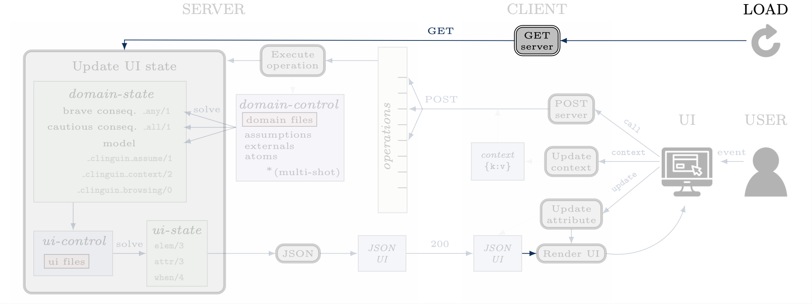
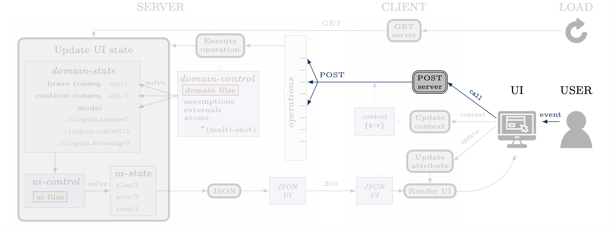
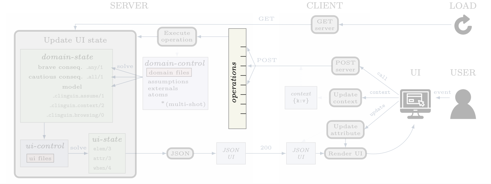
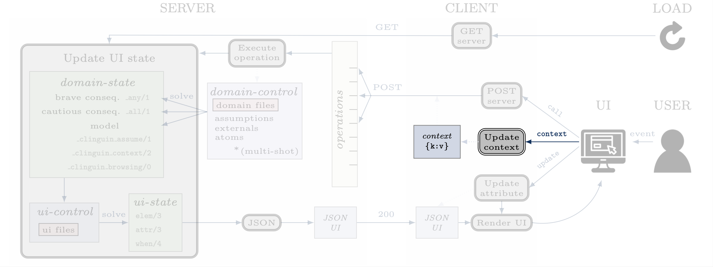
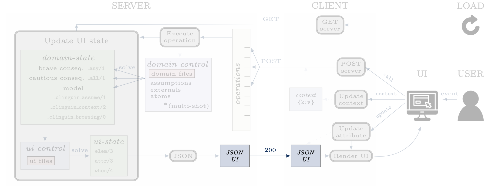

Communication
#############

****
GET
****

When the UI is first loaded and in every reload, the client will do a ``GET`` request which will update the UI.

****
POST
****

When the user triggers as event that is associiated with a ``call`` action, the client will do a ``POST`` request.
This request will include the selected operations and the context.

**********
Operations
**********

The operations are defined by the backend. These operations will interact with the domain control while performing all the required changes.
Each backend will define an available list of operations. These lists can be found in :ref:`Backends`.

********
Context
********

The context can be used to store information provided by the user before calling the server. For instance, it can store the input of a text field, or the value of a checkbox. Therefore, it is usefull for creating input forms within the UI. Internally, the context is represented by a dictionary in the client and it can be accesed in three ways.

.. warning::

    Context information is only available for web frontends and not for Tkinter.

**Updates**

The context information is updated using predicate ``when`` as described above.

.. admonition:: Example

    The context would be updated with the key-value pair `(agree, true)` when `button1` is clicked.

    .. code-block::

        when(button1, click, context, (agree, true)).

To use a value imputed by the user, such as for text fields, the special constant ``_value`` will hold the value of an input event.

.. admonition:: Example

    .. code-block::

        when(textfield1, input, context, (t1_content, _value)).

**Substitution**

The values of the context can be accessed for a direct substitution in the operation of a call. This is done with the special predicate ``_context_value`` with arity 1, 2 or 3.

- The first argument of this predicate is the key which will be substituted by the value before it is processed by the server.
- The second argument is an optional type, which should be ``str``, ``int`` or ``const``. Using this type will type check the input and transform in into the correct type.
If the user provides as input a number 1, it will be trated as a number unless the type is ``str`` in which case it will be transformed to ``"1"``.
If the user provides as input a string that can be an constant, such as ``open``, it will be passed without quotes unless the type is ``str``.
However, if the input is a string that can't be a constant, such as ``Open``, it will quoted even if no type is provided.
- The third argument is an optional default value, this value is taken whenever the key is not present.

.. admonition:: Example

    Example from  the `ast example <https://github.com/krr-up/clinguin/tree/master/examples/angular/ast/ui.lp>`_.
    The key `selected_node` is set open clicking on a node and then this information is sustituted on the next line when the server is called to add an atom, which yeilds operation ``add_atom(show_children(X,true)))`` after the substitution, with ``X`` being the selected node.

    .. code-block::

        when(node(X), click, context, (selected_node, X)):- node(X).
        when(button1, click, call, add_atom(show_children(_context_value(selected_node),true))).

.. admonition:: Example

    Example from  the `ast example <https://github.com/krr-up/clinguin/tree/master/examples/angular/graph_coloring/ui.lp>`_.
    When this button is clicked, the value of the key ``show_download`` will be accessed and transfoermed into a string. If no value is provided then it is substituted by "#show assign/2.".

    .. code-block::

        when(b1, click, call, download(_context_value(show_download, str, "#show assign/2."))).

**Access**

All calls to the server will include the context as an argument. All backends will have access to this dictionary and can use its values for any operation. The provadided backends include the context information as part of the :ref:`domain-state` via predicate ``_clinguin_context(KEY,VALUE)``. Thus, giving the UI encoding access to the context at the time the call was made. Beware that changes in the context are not reflected in the UI encoding imidiatley, but only after calling the server and calculating the UI again.
Notice that the _clinguin_context predicate will only include things after a server call, but not the moment they are set.

.. warning::
    The context is erased after every call to the server.

.. tip::
    If some of the context wants to be preserved between calls to the server, it can be done manually in the UI encoding by using the event ``load`` of the ``window``. An example is provided below, which is used in the `ast example <https://github.com/krr-up/clinguin/tree/master/examples/angular/ast/ui.lp>`_.

    .. code-block::

        when(window, load, context, (selected_node, X)):- _clinguin_context(selected_node, X).

********
JSON UI
********

The :ref:`ui-state` is represented by a JSON to comunicate between client and server. This JSON is generated in a herachical fashion where each element apears with the following form.

.. code-block::

    {
        "id": <the id of the element>,
        "type": <the type of the element>,
        "parent": <the id of the partent element>,
        "attributes": <the list of associated attribute>
            [
                {
                    "id": <the id of the element>,
                    "key": <attribute key>,
                    "value": <attribute value>
                },
                ...
            ],
        "when": <the list of associated actions>
            [
                {
                    "id": <the id of the element>,
                    "event": <the event>,
                    "action": <the interaction type>,
                    "operation": <the operation>
                }
            ],
        "children": <the list of all children>[]
    }

.. admonition:: Example

    The following :ref:`ui-state` the corresponding JSON UI can be found below.

    .. code-block::

        elem(w, window, root).
        elem(b1, button, w).
        attr(b1, label, "Button 1").
        when(b1, click, call, next_solution).

    .. code-block::

        {
            "id":"root",
            "type":"root",
            "parent":"root",
            "attributes":[],
            "when":[],
            "children":[
                {
                    "id":"w",
                    "type":"window",
                    "parent":"root",
                    "attributes":[],
                    "when":[],
                    "children":[
                        {
                        "id":"b1",
                        "type":"button",
                        "parent":"w",
                        "attributes":[
                            {
                                "id":"b1",
                                "key":"label",
                                "value":"\"Button 1\""
                            }
                        ],
                        "when":[
                            {
                                "id":"b1",
                                "event":"click",
                                "action":"call",
                                "operation":"next_solution"
                            }
                        ],
                        "children":[]
                        }
                    ]
                }
            ]
        }

