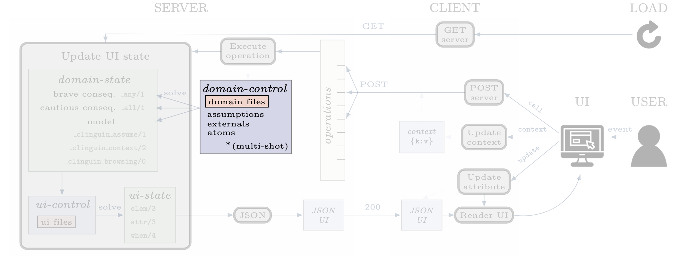
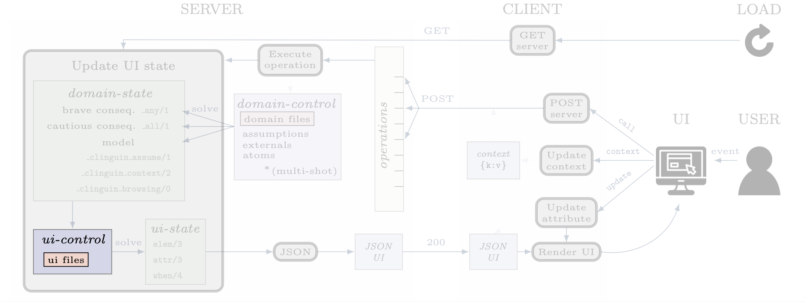

Control
#######

**************
domain-control
**************

The *Clingo* control that will be handled by the Backend.
It includes the domain files and can be accessed by the actions performed by the user.
Most backends handle this control in a multi-shot fashion, where grounding is only done once (or on demand), and assumptions, as well as externals, are used to alter the solving. The domain-control is used to generate the :ref:`domain-state`.

**************
ui-control
**************

The *Clingo* control that will be used to compute the :ref:`ui-state` using the :ref:`ui-files`.
This control is initialized every time the UI is updated.

