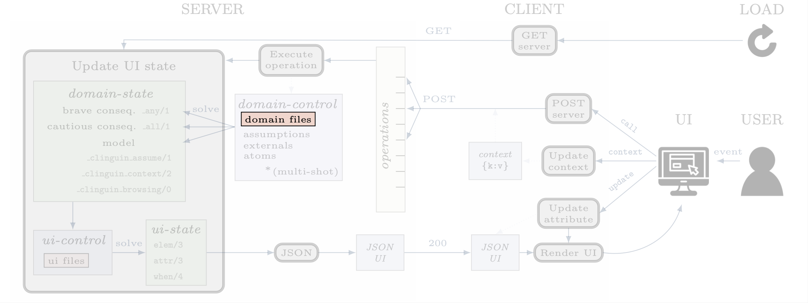
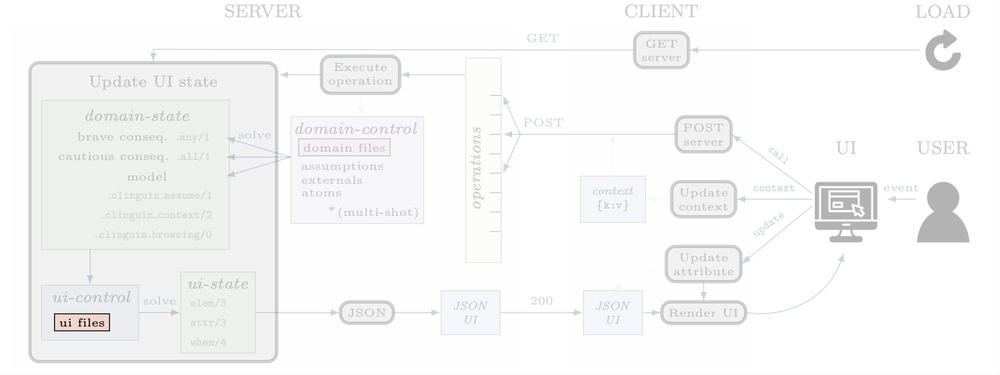

Input
#####

************
domain-files
************

The domain-specific ASP encodings that will generate solutions to the problem (including the instance).
These files will be used by the :ref:`domain-control`.
They are provided when starting the server via the command line in argument ``--domain-files``.

.. warning::

    **Show statements**

    The show statements in your :ref:`domain-files` will impact the atoms present in the :ref:`domain-state`.
    If you are using show statements, and you want to use ``_any(a)`` for an atom ``a``, that is not part of your show statements,
    then you have to add ``#project a.`` to your :ref:`domain-files` to get the desired output.
    Furthermore any show statements that output a tuple (function without name) will lead to syntactic issues so thet should be removed.

************
ui-files
************

The encoding that will generate the :ref:`ui-state` using the :ref:`domain-state` as input.
They are provided when starting the server via the command line in argument ``--ui-files``.

.. tip::

    There are helper functions available for the UI files to handle strings. This functions can be used with the *clingo* syntax for external function: ``@fun(args)``.
    See :ref:`ClinguinContext` for more information.