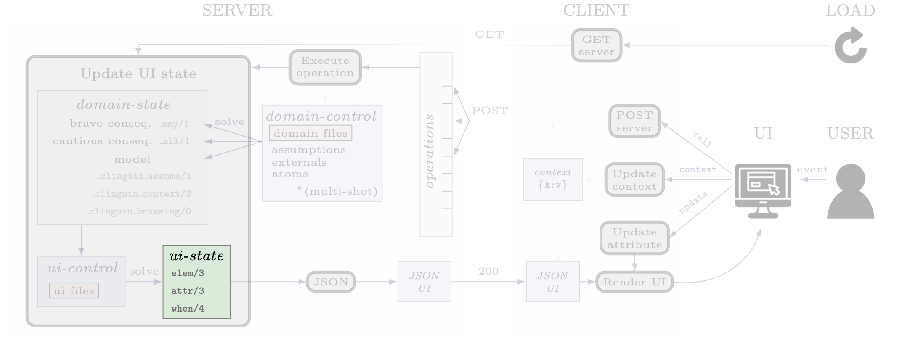
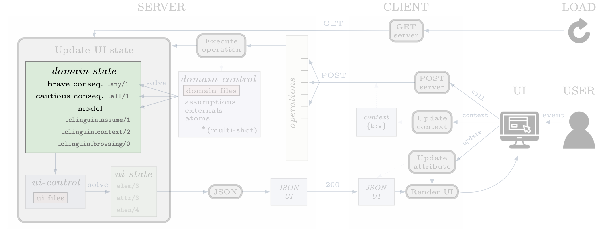

State
#####

States are sets of ASP facts that are used to define diferent aspects of the system.

********
ui-state
********

A User Interface is defined in `clinguin` using the three predicates below.
These facts are generated by calling clingo with the :ref:`domain-state` and the provided :ref:`ui-files`.

.. note::

    The available element types, attributes, events, and actions will vary depending on the frontend. See the details for each front end in the :ref:`Frontends` section.

**Elements** ``elem(ID, TYPE, PARENT)``

Elements define building blocks of the UI.

- ``ID`` Identifies the element for further references.

- ``TYPE`` The type of element (``window``, ``container``, ``button`` etc).

- ``PARENT`` The id of the parent element. The identifier ``root`` is used as the root element of the UI.

**Attributes** ``attr(ID, KEY, VALUE)``

Attributes define the style of the UI.

- ``ID`` Identifier of the element that the attribute will be set to.

- ``KEY`` The name of the attribute. Available attributes depend on the element type and the frontend.

- ``VALUE`` The value of the attribute.

**Actions** ``when(ID, EVENT, ACTION, OPERATION)``

Actions define the interactivity of the UI.  Multiple actions are allowed, as explained below.

- ``ID`` Identifier of the element that the user interacted with.

- ``EVENT`` The event that is being triggered, such as ``click``, ``hover``,  ``input``, etc. Each element type allows different events.

- ``ACTION`` The action performed.
    - ``call`` Calls the server to perform an operation.
    - ``update`` Updates the attribute of another element without any calls to the server.
    - ``context`` Updates the internal context that will be passed to the server on the following call actions. See :ref:`Context` for more details.

- ``OPERATION`` The operation accounts for the information that the action requires for its execution.
    - ``ACTION`` = ``call`` The operation corresponds to a public operation from the :ref:`Backends`. The function call is represented as a predicate, for instance ``add_assumption(a)`` or ``next_solution``.
    - ``ACTION`` = ``update`` The operation will be a tuple of size three ``(ID', KEY, VALUE)`` where ``ID'`` is the identifier of the element whose value for attribute ``KEY`` will be updated to ``VALUE``. Notice that ``ID'`` might be different than ``ID``.
    - ``ACTION`` = ``context`` The operation will be a tuple ``(KEY, VALUE)``, which will update the key ``KEY`` in the context dictionary to ``VALUE``. See the :ref:`Context` section for detail information on how to use the context.

**Multiple actions**

If multiple occurrences of the predicate ``when`` are present for the same element and event. All of them will be executed. First, the updates will be performed, followed by context changes and finally server calls. Within each type of action, no order can be assured.

In the case of multiple appearances of ``call``,  a single call will be placed to the server with the information to execute all actions in any order.

.. admonition:: Example

    When ``button1`` is clicked, the server will receive the instruction to execute two operations: adding assumption ``a`` and adding assumption ``b`` in any order. For a more evolved example of this feature, see the `jobshop example <https://github.com/krr-up/clinguin/tree/master/examples/angular/jobshop/ui.lp>`_.

    .. code-block::

        when(button1, click, call, add_assumption(a)).
        when(button1, click, call, add_assumption(b)).

To impose an order, the operation provided must be a tuple, in which case the order of execution is defined by the tuple.

.. admonition:: Example

    This example below will make sure that assumption ``a`` is added before computing a solution.

    .. code-block::

        when(button1, click, call, (add_assumption(a), next_solution)).

************
domain-state
************

A set of facts defining the state of the domain, which will be used as input to the :ref:`ui-files`.
These facts are generated by multiple domain-state constructors defined by the backend.
Each backend will define its own domain-state constructors which can involve solve calls or any other information.
The domain-state constructors can be found in :ref:`backends`.
In what follows we explain in detail the list of base constructors used in the :ref:`ClingoMultishotBackend`,
for further details check the API documentation for the backend of your interest.

The domain state of :ref:`ClingoMultishotBackend` will provide a model and some useful reasoning information;
when creating a UI one usually needs to reason with what is still *possibly* part of the solution and what is *necessarily* in the solution.
In ASP terms, we use the following brave and cautious reasoning to provide this information as explained below.

Browsing
--------

**Model**

The atoms of the first computed model are added directly to the :ref:`domain-state`. When the user is browsing the solutions, this model will change accordingly.

**_clinguin_browsing/0**

This constant is present when the user is browsing models, meaning that the ``next()`` operation has been requested. It can be used to decide whether the UI must show the current model.
These are only of interest if you are using optimization statements in your :ref:`domain-files`.

Consequences
------------

**Brave consequences**

Atoms that are in any stable models (Union) of the :ref:`domain-control`. These atoms are part of the :ref:`domain-state` enclosed in predicate ``_any``.
We usually employ brave consequences to create elements where we want to provide the user with all the possible options. For instance, in a dropdown menu. By using brave consequences, we make sure that these selections lead to a valid answer.

.. warning::

    **Performance**

    To improve performance these atoms are only obtained if the predicate ``_any`` is part of the :ref:`ui-files`.

.. warning::

    **Show statements**

    The show statements in your :ref:`domain-files` will impact the atoms present in these consequences.
    If you are using show statements, and you want to use ``_any(a)`` for an atom ``a``, that is not part of your show statements,
    then you have to add ``#project a.`` to your :ref:`domain-files` to get the desired output.
    Furthermore any show statements that output a tuple (function without name) will lead to syntactic issues so thet should be removed.

.. admonition:: Example

    Consider the following encoding, where either  ``p(1)`` or ``p(2)`` can be selected.

    .. code-block::

        1{p(1);p(2)}1.

    We have two stable models: `{p(1)}` and `{p(2)}`, so brave consequences (union) are `{p(1), p(2)}`.
    Therefore the following atoms will be added to the :ref:`domain-state`.

    .. code-block::

        _any(p(1)).
        _any(p(2)).

**Cautious consequences**

Atoms that are in all stable models (intersection) of the :ref:`domain-control`. These atoms are part of the :ref:`domain-state` enclosed in predicate ``_all``.
We usually employ cautious consequences when we want to show the user any inferences done by the solver. For instance, the selected value of a dropdown menu. Naturally, assumptions made by the user will impact these consequences.

.. warning::

    **Performance**

    To improve performance these atoms are only obtained if the predicate ``_any`` is part of the :ref:`ui-files`.

.. warning::

    **Show statements**

    The show statements in your :ref:`domain-files` will impact the atoms present in these consequences.
    If you are using show statements, and you want to use ``_all(a)`` for an atom ``a``, that is not part of your show statements,
    then you have to add ``#project a.`` to your :ref:`domain-files` to get the desired output.

.. admonition:: Example

    Consider the following encoding, where either  ``p(1)`` or ``p(2)`` can be selected.

    .. code-block::

        1{p(1);p(2)}1.
        :- p(2).

    We have one stable model: `{p(1)}`.
    Therefore the following atoms will be added to the :ref:`domain-state`.

    .. code-block::

        _all(p(1)).

**_clinguin_unsat/0**

This constant is present if the :ref:`domain-control` gave an unsatisfiable response.

User input
----------

**_clinguin_assume/2**

These atoms give information about what has been assumed by the user via the backend instructions.

.. admonition:: Example

    In the `sudoku example <https://github.com/krr-up/clinguin/tree/master/examples/angular/sudoku/ui.lp>`_, presented in section :ref:`Quick Start`, the following lines define the color of the selected value of a dropdown menu.
    When the value was set by the user, which we can know if ``_clinguin_assume(sudoku(X,Y,V), true)`` is part of the :ref:`domain-state`, then we show it using the primary color (blue). Otherwise, the value was inferred by the system and we show it using the info color (gray).

    .. code-block::

        attr(dd(X,Y),class,("text-primary")):-_clinguin_assume(sudoku(X,Y,V), true).
        attr(dd(X,Y),class,("text-info")):-_all(sudoku(X,Y,V)), not _clinguin_assume(sudoku(X,Y,V), true).

**_clinguin_context/2**

These atoms provide access to the context information available in the frontend when the :ref:`domain-state` is generated. The first argument is the key, and the second one is the value. For more information check the :ref:`Context` section.

**_clinguin_const/2**

Includes predicate ``_clinguin_const/2`` for each constant provided in the command line and used in the domain files.

Optimization
------------

**Brave optimal consequences**

These consequences work similar to the brave consequences, but they are the union of all optimal models.
They are enclosed in predicate ``_any_opt``.

.. warning::

    **Performance**

    To improve performance these atoms are only obtained if the predicate ``_any_opt`` is part of the :ref:`ui-files`.

.. admonition:: Example

    In the `placement optimaized example <https://github.com/krr-up/clinguin/tree/master/examples/angular/placement_optimized/ui.lp>`_.

    .. code-block::

        elem(table_seat_p(T,S,P), dropdown_menu_item, table_seat(S,T)):-seat(S,T), person(P).
        attr(table_seat_p(T,S,P), class, "text-success"):- _any_opt(assign(seat(S,T),P)).

    Here the text on the dropdown menu item will be highloghted green if there is an optimal solution where the person P is assigned to the seat S at table T.

**Cautious optimal consequences**

These consequences work similar to the cautious consequences, but they are the interesection of all optimal models.
They are enclosed in predicate ``_all_opt``.

.. warning::

    **Performance**

    To improve performance these atoms are only obtained if the predicate ``_any_opt`` is part of the :ref:`ui-files`.

.. admonition:: Example

    In the `placement optimaized example <https://github.com/krr-up/clinguin/tree/master/examples/angular/placement_optimized/ui.lp>`_.

    .. code-block::

        attr(table_seat(S,T), selected, P):- _all_opt(assign(seat(S,T),P)), not _all(assign(seat(S,T),P)).
        attr(table_seat(S,T), class, "text-success"):- _all_opt(assign(seat(S,T),P)), not _all(assign(seat(S,T),P)).

    Here the text that is selected is the one appearing in all optimal models. This way it can serve as a guide for the user to see what is the best solution found so far.

**Optimization state**

The following predicates are used to give the ui information about the current cost of the solution.

- ``_clinguin_cost/1``: With a single tuple indicating the cost of the current model
- ``_clinguin_cost/2``: With the index and cost value, linearizing predicate ``_clinguin_cost/1``
- ``_clinguin_optimal/0``: If the solution is optimal
- ``_clinguin_optimizing/0``: If there is an optimization in the program
