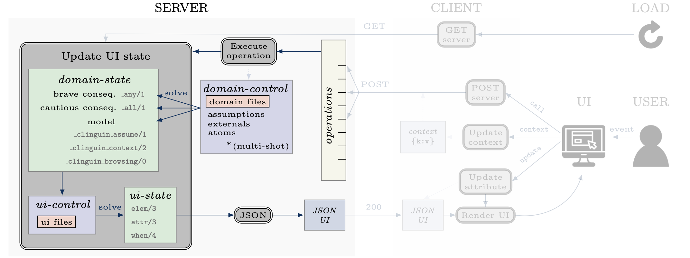
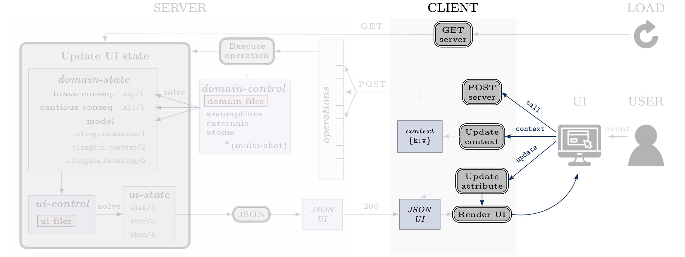

Structure
#########

******
Server
******

The server is responsible for executing clingo and computing the information required to define the UI. This process unfolds in two distinct steps:

1. The :ref:`domain-state` is computed using the domain-specific encodings difined in the :ref:`domain-files`. These information include user-selected atoms, potential selections, and inferred atoms.
2. The server utilizes the provided UI encoding to generate the :ref:`ui-state`, defining the layout, style, and functionality of the interface.

To allow flexibility, further separation is done to have interchangeable functionalities.

**Backend**

The part of the server that defines the control and functionality, allowing users to interact with the clingo control in different ways.
It offers the option to define and overwrite operations, as well as customize how the UI is updated and the contextual information in the :ref:`domain-state`.
Users can create their own Backend to increase functionality (:ref:`Creating your own backend`).

We provide the following :ref:`Backends` with the system:

* *ClingoBackend*: Basic clingo functionality using single-shot solving
* *ClingoMultishotBackend*: clingo functionality using multi-shot solving
* *ClingraphBackend*: ClingoMultishotBackend enhanced with the option to render and interact with Clingraph images
* *ExplanationBackend*: ClingoMultishotBackend enhanced with explanation functionalities via Minimal Unsatisfiable Cores
* *ClingoDLBackend*:  ClingoMultishotBackend enhanced with `clingod-dl <https://potassco.org/labs/clingoDL/>`_

******
Client
******

The client is responsible for rendering the UI and responding to the user's actions.
When it is loaded, it requests the :ref:`ui-state` from the server.
Upon receiving the :ref:`ui-state` in JSON format (:ref:`JSON UI`), the client utilizes a front-end language to render the corresponding UI.

To allow flexibility, further separation is done to have interchangeable UIs and functionalities.

**Frontend**

The part of the client that generates the layout based on the :ref:`JSON UI` and displays the UI.  Users can create their own Frontend to have a different view (:ref:`Creating your own frontend`).  

We provide the following :ref:`Frontends` with the system:

* *AngularFrontend*: UI using Angular to generate a web interface 
* *TkinterFrontend*: UI using Tkinter an OS-dependent interface
