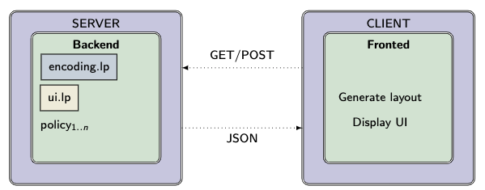
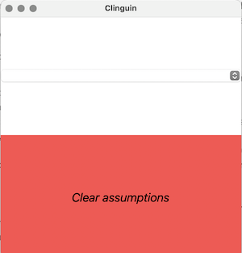

User Guide
##########

This guide is for the people, who want to get to know how `clinguin` works.
It assumes `clinguin` has already been installed es described in :ref:`Installation`

Mechanics
=========

The `clinguin` system uses a Client-Server Architecture, thus it is separated into two processes. 

* **Server**: Will run a clingo process in the background and generate a UI specification based on a UI encoding and a domain specific encoding. It will then wait for notifications by the client to interact with the clingo process trough the *Backend*.

* **Client**: Will ask the server for the information to render the UI with the selected *Frontend*. Then send the information corresponding to the user selection back to the server.

To allow flexibility, further separation is done to have interchangeable Backends and Frontends.

* **Backend**: Will define the control and functionality (policies) that is available. The backend will start the clingo solving process and manage the encoding and the ui. The user can create their own Backend to increase functionality (See the :ref:`Customize Guide` for more information). We provide the following `Backends <https://github.com/krr-up/clinguin/tree/master/clinguin/server/application/backends>`_ with the system:

    * *ClingoBackend*: Basic clingo functionality
    * *ClingraphBackend*: Basic clingo functionality with the option to render clingraph images on the side
    * *TemporalBackend*: Basic temporal functionalities
    * *ExplanationBackend*: Basic explanation functionalities

* **Frontend**: Will generate the layout based on a JSON and display the UI. The user can create their own Frontend to have a different view (See the :ref:`Customize Guide` for more information).  the following `Frontends <https://github.com/krr-up/clinguin/tree/master/clinguin/client/presentation/frontends>`_ with the system:

    * *Tkinter*: UI using the well known tkinter interface

Basic Usage
===========

We will use **Sudoku** as an example. 
All files used can be find `here <https://github.com/krr-up/clinguin/tree/master/examples/clingo/sudoku>`_.

Client-Server
+++++++++++++

To run `clinguin` one can the execute the following command:

.. code-block:: bash

    $ clinguin client-server --source-files examples/clingo/sudoku/instance.lp examples/clingo/sudoku/encoding.lp --ui-files examples/clingo/sudoku/ui.lp

After execution a Sudoku window should open, where one can play a round of Sudoku. The look of the window will vary depending on the OS.

.. figure:: ../../examples/clingo/sudoku/sudoku.png

The `client-server` option provided in the command line, states that both client and server shall be started at the same time, so it has the look and feel of a single program. If one wants to seperate `client` and `server`, one could start them in two shells

Server
++++++

.. code-block:: bash

    $ clinguin server --source-files examples/clingo/sudoku/instance.lp examples/clingo/sudoku/encoding.lp --ui-files examples/clingo/sudoku/ui.lp

The source and gui files are only specified for the server, the client does not need to care about this. As one can see, we have specified three files: ``instance.lp``, ``encoding.lp`` and ``ui.lp``. This is a common separation for `clinguin`, therefore one can at first experiment with the encoding/problem one is working on, and after that create a ui for the problem, to showcase, debug, etc. 

When running the server one can further specify the *Backend* that should be used. See the :ref:`Customize Guide` for more information.

Client
++++++

.. code-block:: bash

    $ clinguin client 

The client does not need any files as input since it will ask the server for the information.

When running the client one can further specify the *Frontend* that should be used. See the :ref:`Customize Guide` for more information. See the :ref:`Customize Guide` for more information.

Basic example
=============

After the startup of your first `clinguin` example, it is now time to understand the basic techniques how to write your own UI encoding. For this you must create two files:

* ``empty.lp`` An empty file which will be used instead of a domain specific encoding.
* ``ui.lp`` A ui-file that will define the look and interactivity of your interface.

To define a UI, `clinguin` uses three different predicates:

* ``element(ID,TYPE,PARENT)``:  Corresponds to an element in the Gui (button, frame, etc).
* ``attribute(ID_OF_ELEMENT,KEY,VALUE)``: Used to set various attributes of an element, (background-color, font, etc). 
* ``callback(ID_OF_ELEMENT,ACTION,POLICY)``: Used to define how an element behaves (how = policy) on certain actions.

.. note::
    
    Each `clinguin` ``ui.lp`` file must contain exactly one element of type ``window``. 

.. rubric:: *Example*
    :name: example-window

For example, the following code generates a window with the dimensions 400x400 and with the background color pink:

.. code-block::

    element(window, window, root).
    attribute(window, height, 400).
    attribute(window, width, 400).
    attribute(window, background_color, pink).

The next task is to execute this program and show actually the window. This can be done by:

.. code-block:: bash

    $ clinguin client-server --source-files empty.lp --ui-files ui.lp

Reasoning modes
===============

When creating a UI one usually needs to reason with what is still *possibly* part of the solution and what is *necessarily* in the solution.
We use this information to know all the available options that should appear in the UI. 
In ASP terms, we use the following types of reasoning.

* *Brave reasoning*: What is in part of any stable models. (Union)
* *Cautious reasoning*: What is in part of all the stable models. (Intersection)

To access this information when creating a UI, the atoms in the input which were concluded *bravely*, are enclosed in the predicate ``_b``, all other atoms are left in their usual form.

We usually employ brave consequences to create elements where we can select different options like dropdown menus (shown in the example below).
Then, the cautious consequences can be used to set the selected element.

Consider the following encoding, where either  ``p(1)`` or ``p(2)`` can be selected.

.. code-block::

    1{p(1);p(2)}1.

We have two stable models: `{p(1)}` and `{p(2)}`.
The brave consequences (union) are `{p(1), p(2)}` while the cautions consequences (intersection) are `{}`.
Therefore the input to generate our UI would be:

.. code-block::

    _b(p(1)).
    _b(p(2)).

If we include an integrity constraint (similarly if we add an assumption) to our encoding:

.. code-block::

    1{p(1);p(2)}1.
    :-(p2).

We have one stable model `{p(1)}`.
Then the brave and cautious consequences are `{p(1)}`.
Therefore the input to generate our UI would be:

.. code-block::

    _b(p(1)).
    p(1).

Syntax
======

One can look the up the available elements, with the corresponding attributes and callback actions using:

.. code-block:: bash
    
    $ clinguin client-server --frontend-syntax

If one is  also interested in what values one might set, one can also look at the full syntax:

.. code-block:: bash
    
    $ clinguin client-server --frontend-syntax-full

``element(ID,TYPE,PARENT)``
+++++++++++++++++++++++++++

* ``ID`` Identifies the element for further references.

* ``TYPE`` The type of element (``window``, ``container``, ``button`` etc)

* ``PARENT`` The id of the parent element. The ``root`` identifier is used as the root element of the UI. 

``attribute(ID_OF_ELEMENT,KEY,VALUE)``
++++++++++++++++++++++++++++++++++++++

For each of these element types there exists a bunch of available attributes to set how the element will look like. 

* ``ID_OF_ELEMENT`` Identifier of the element setting the attribute to

* ``KEY`` The name of the attribute 

* ``Value`` The value of the attribute 

``callback(ID_OF_ELEMENT,ACTION,POLICY)``
+++++++++++++++++++++++++++++++++++++++++

* ``ID_OF_ELEMENT`` Identifier of the element to which the action is performed

* ``ACTION`` The action performed (``click``, ``hover``, etc). Each element allows different actions.

* ``POLICY`` The functionality from the Backend that will be called when the action is performed on the element. The available policies can be looked up in the API documentation under the section `Server`/`Server Backends`/`ClingoBackend` (class `ClingoBackend`).

Elaborated example
++++++++++++++++++

This example captures a bit more how one structures the frontend. For this we take a simple logic program as our source-file (e.g. `source.lp`), which has two models: `p(1)` and `p(2)`:

.. code-block::

    1{p(1);p(2)}1.

Now we create a UI (e.g. ``ui.lp``), where we assume either ``p(1)`` or ``p(2)`` and provide a functionality to reset it:

.. code-block::

    element(window, window, root).
    attribute(window, height, 400).
    attribute(window, width, 400).

    element(dpm, dropdown_menu, window).
    attribute(dpm, selected, V) :- p(V).

    element(dmp(V), dropdown_menu_item, dpm) :- _b(p(V)).
    attribute(dmp(V), label, V) :- _b(p(V)).
    callback(dmp(V), click, add_assumption(p(V))) :- _b(p(V)).

    element(l, label, window).
    attribute(l, label, "Clear assumptions").
    attribute(l, font_weight, "italic").
    attribute(l, font_size, 20).
    attribute(l, background_color, "#ff4d4d").
    attribute(l, on_hover, "True").
    attribute(l, on_hover_background_color, "#990000").
    callback(l, click, clear_assumptions).

With this done, we can start our application:

.. code-block:: bash

    $ clinguin client-server --source-files source.lp --ui-files ui.lp

We have four different elements:

1. ``window`` (window)

    * As in the previous example it just defines the size of the window.

2. ``dpm`` (dropdown_menu) 

    * It's parent is the ``window`` which means, that it is directly shown below the window. 
    * The attribute ``selected`` can be used to show the text in the ''selected'' field of the dropdown.

3. ``dpm(V)`` (dropdown_menu_item) 

    * A dropdown_menu_item can only be the child of a dropdown_menu (and no other element type)
    * We want to have one item for each model, therefore we have the ``_b(p(V))`` in the body. The atom preceded by an underscore: ``_b`` means, that we reason bravely (so basically the union of all models), therefore we have here both ``p(1)`` and ``p(2)``.
    * We add an attribute to define the text (attribute key ``label``)
    * We add a callback to define what shall happen on a click. In this case the policy ``add_assumption`` is called with the parameter ``p(V)``. Doing so, we add the assumption, that either ``p(1)`` or ``p(2)`` exist.

4. ``l`` (label)

    * We use this label to display the text `Clear assumptions` and further create an action, that when one clicks on it, all assumptions are cleared.
    * All other attributes are only there for the look and feel of the label (on hover, etc.)

