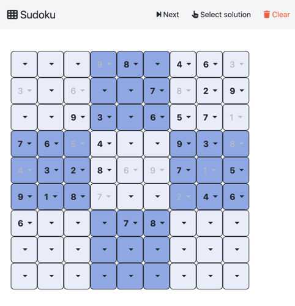
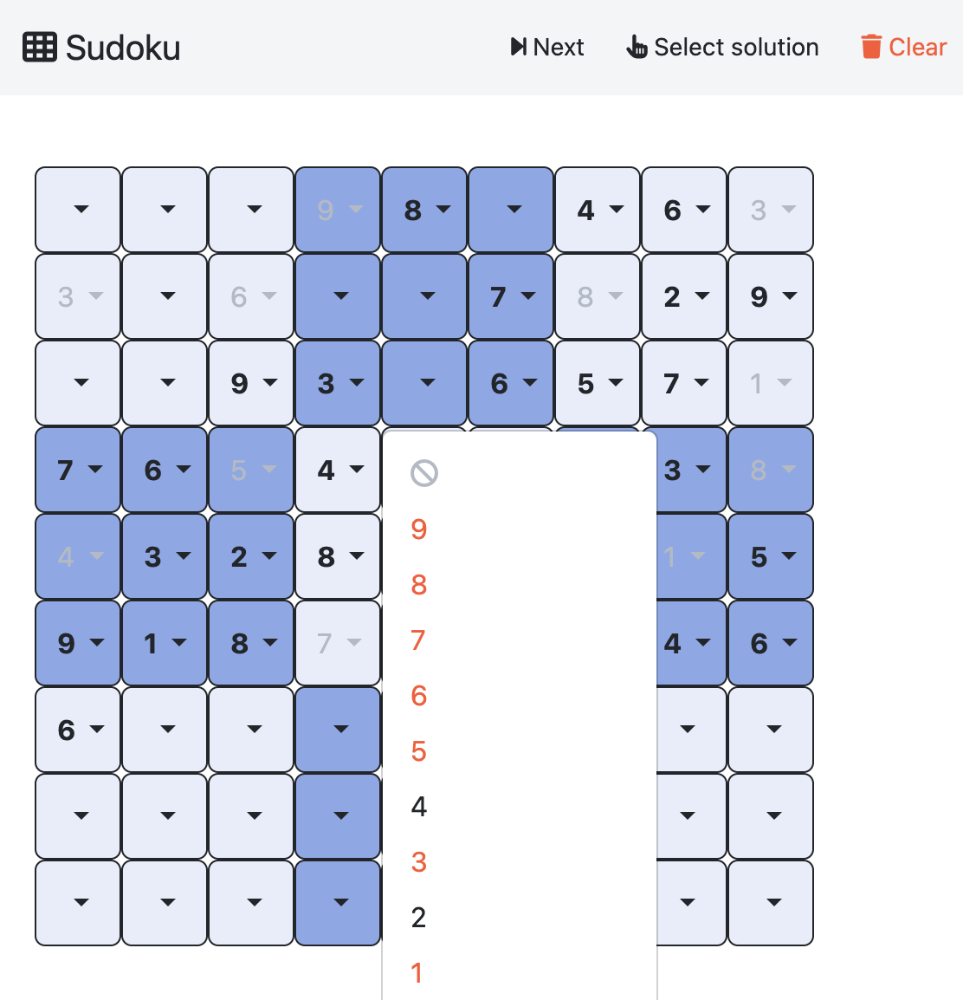

User Guide
##########

This guide explains the internal workflow of `clinguin`. The full workflow of the system is shown in the figure below, it will be explanied in detail on this gide and can be used as reference.

.. figure:: ../workflow.png

Overview
=========

Clinguin employs a Client-Server architecture, where communication occurs via an HTTP protocol using JSON.

* **Server**: is responsible for executing clingo and computing the information required to define the UI. This process unfolds in two distinct steps:

    1. The `domain-state` is computed using the domain-specific encodings, defined by facts that differentiate between user-selected atoms, potential selections, and inferred atoms.
    2. The server utilizes the provided UI encoding to generate atoms defining the layout, style, and functionality of the interface, collectively referred to as the `ui-state`.

* **Client**: it requests the `ui-state` from the server. Upon receiving the `ui-state` in JSON format, the client utilizes a front-end language to render the corresponding UI.

To allow flexibility, further separation is done to have interchangeable functionalities on the server and client. 

* **Backend**: The part of the server that defines the control and functionality, allowing users to interact with the clingo control in different ways. It offers the option to define and overwrite operations, as well as customize how the UI is updated and the contextual information in the `clinguin-state`. The user can create their own Backend to increase functionality (See the :ref:`Customize Guide` for more information). We provide the following `Backends <https://github.com/krr-up/clinguin/tree/master/clinguin/server/application/backends>`_ with the system:

    * *ClingoBackend*: Basic clingo functionality using single-shot solving
    * *ClingoMultishotBackend*: Clingo functionality using multi-shot solving
    * *ClingraphBackend*: ClingoMultishotBackend enhanced with the option to render and interact with clingraph images
    * *ExplanationBackend*: ClingoMultishotBackend enhanced with explanation functionalities via Minimal Unsatisfiable Cores
    * *ClingoDLBackend*:  ClingoMultishotBackend enhanced with `clingod-dl <https://potassco.org/labs/clingoDL/>`_

* **Frontend**: The part of the client that generates the layout based on a JSON and displays the UI.  The user can create their own Frontend to have a different view (See the :ref:`Customize Guide` for more information).  We provide the following `Frontends <https://github.com/krr-up/clinguin/tree/master/clinguin/client/presentation/frontends>`_ with the system:

    * *TkinterFrontend*: UI using Angular to generate a web interface 
    * *AngularFronted*: UI using tkinter an OS-dependent interface

Basic Usage
===========

We will use **Sudoku** as an example, and run it using the `ClingoMultishotBackend` and the `AngularFrontend`.
All files used can be find `here <https://github.com/krr-up/clinguin/tree/master/examples/angular/sudoku>`_.

Running clinguin 
----------------

Client-Server
+++++++++++++

To run `clinguin` one can the execute the following command:

.. code-block:: bash

    $ clinguin client-server --domain-files examples/angular/sudoku/instance.lp examples/angular/sudoku/encoding.lp --ui-files examples/angular/sudoku/ui.lp --frontend AngularFrontend

After the execution, a Sudoku window in your browser should open, where one can play a round of Sudoku.

The `client-server` option provided in the command line, states that both client and server shall be started at the same time, so it has the look and feel of a single program. If one wants to seperate `client` and `server`, one could start them in two shells.

Server
++++++

.. code-block:: bash

    $ clinguin server --domain-files examples/angular/sudoku/instance.lp examples/angular/sudoku/encoding.lp --ui-files examples/angular/sudoku/ui.lp

The source and ui files are only specified for the server, the client does not need to care about this. As one can see, we have specified three files: ``instance.lp``, ``encoding.lp`` and ``ui.lp``. This is a common separation for `clinguin`, therefore one can at first experiment with the problem one is working on, and after that create a ui for the problem, to showcase, debug, etc.

When running the server one can further specify the *Backend* that should be used. See the :ref:`Customize Guide` for more information.

Client
++++++

.. code-block:: bash

    $ clinguin client --frontend AngularFrontend

The client does not need any files as input since it will ask the server for the information.

When running the client one can further specify the *Frontend* that should be used. See the :ref:`Customize Guide` for more information. See the :ref:`Customize Guide` for more information.

Understanding the UI encoding 
-----------------------------

Let's adress the UI `encoding <https://github.com/krr-up/clinguin/tree/master/examples/angular/sudoku/ui.lp>`_ by sections. For details on the sytax and the creation of elements see the :ref:`Syntax and Components` section.

Each UI encoding file must contain exactly one element of type ``window``. The encoding below creates a windon element identified by ``w`` inside the ``root``.

.. code-block::

    elem(w, window, root).

Then, inside the window we create a container which is identified by ``sudoku`` and will hold the sudoku grid. The ``attr`` facts will set the layout as a grid and the size of the element.

.. code-block::

    elem(sudoku,container,w).
    attr(sudoku,child_layout,grid).
    attr(sudoku,width,100).
    attr(sudoku,height,100).

In the container we create a dropdown menu for each position in the sudoku and identify it by ``dd(X,Y)``. 
The first four lines will set the size and position of the dropdown. The special angular attribute ``class`` will set the style of the dropdown depending on the subgrid it belongs to, and if it is an initial value. In the last lines we use the following special predicates. First, ``_clinguin_assume``, and ``_clinguin_browsing`` are part of the clinguin state (which can be extended by the Backend). Then, we use the predicate ``_c`` for accessing atoms that are in all models (see :ref:`Reasoning information`). By doing so, the last two lines define the selected value of the dropdown as the value that the sudoku encoding is infering, either by a user assumption or due to the domain constraints.

.. code-block::

    elem(dd(X,Y),dropdown_menu,sudoku):-pos(X,Y).
    attr(dd(X,Y),width,50):-pos(X,Y).
    attr(dd(X,Y),height,50):-pos(X,Y).
    attr(dd(X,Y),grid_column,X):-pos(X,Y).
    attr(dd(X,Y),grid_row,Y):-pos(X,Y).
    attr(dd(X,Y),class,("border-dark";"bg-primary")):-pos(X,Y).
    attr(dd(X,Y),class,"bg-opacity-10"):-subgrid(X,Y,S), S\2==0.
    attr(dd(X,Y),class,"bg-opacity-50"):-subgrid(X,Y,S), S\2!=0.
    attr(dd(X,Y),class,("opacity-100";"disabled";"fw-bold";"text-dark")):-initial(X,Y,V).
    attr(dd(X,Y),class,("text-primary")):-_clinguin_assume(sudoku(X,Y,V)).
    attr(dd(X,Y),class,("text-info")):-_c(sudoku(X,Y,V)), not _clinguin_assume(sudoku(X,Y,V)).
    attr(dd(X,Y),selected,V):-_c(sudoku(X,Y,V)).
    attr(dd(X,Y),selected,V):-sudoku(X,Y,V), _clinguin_browsing.

As part of the dropdown we add the different drowdown menu items for all possible values the cell can take. In this case we all all values as items byt using the ``class`` attributem those that are not part of the brave consequences will apear in red and disabled. When a click is performed on the item, the server will be called and instructed to perform the operation ``add_assumption(sudoku(X,Y,V))``.

.. code-block::

    elem(ddi(X,Y,V),dropdown_menu_item,pos(X,Y)):-pos(X,Y), val(V).
    attr(ddi(X,Y,V),label,V):-pos(X,Y), val(V).
    attr(ddi(X,Y,V),class,("text-danger";"disabled")):-pos(X,Y), val(V), not _b(sudoku(X,Y,V)).
    when(ddi(X,Y,V),click,call,add_assumption(sudoku(X,Y,V))):-pos(X,Y), val(V).

We add an additional item in each dropdown menu to clear any previous selection.

.. code-block::
    elem(remove(X,Y), dropdown_menu_item, dd(X,Y)):-pos(X,Y).
    attr(remove(X,Y), icon, ("fa-ban";"text-info")):-pos(X,Y).
    when(remove(X,Y), click, call, remove_assumption_signature(sudoku(X,Y,any))):-pos(X,Y).

Finally, we use the menu bar component type to add the title and different operations in the top of the UI. Those options include, removing all assumptions and browsing the solutions. 

.. code-block::

    elem(menu_bar, menu_bar, w).
    attr(menu_bar, title, "Sudoku").
    attr(menu_bar, icon, "fa-table-cells").

        elem(menu_bar_clear, button, menu_bar).
        attr(menu_bar_clear, label, "Clear").
        attr(menu_bar_clear, icon, "fa-trash").
        attr(menu_bar_clear, class, ("btn-outline-danger";"border-0")).
        when(menu_bar_clear, click, callback, clear_assumptions).

        elem(menu_bar_select, button, menu_bar).
        attr(menu_bar_select, label, "Select solution").
        attr(menu_bar_select, icon, "fa-hand-pointer").
        when(menu_bar_select, click, callback, select).

        elem(menu_bar_next, button, menu_bar).
        attr(menu_bar_next, label, "Next").
        attr(menu_bar_next, icon, "fa-forward-step").
        when(menu_bar_next, click, callback, next_solution).

Reasoning information
---------------------

When creating a UI one usually needs to reason with what is still *possibly* part of the solution and what is *necessarily* in the solution.
We use this information to know all the available options that should appear in the UI.
In ASP terms, we use the following types of reasoning.

* *Brave reasoning*: What is in part of any stable models. (Union)
* *Cautious reasoning*: What is in part of all the stable models. (Intersection)

To access this information when creating a UI, the atoms in the input which were concluded *bravely*, are enclosed in the predicate ``_b``, and concluded *cautiouly*, are enclosed in the predicate ``_c``. Additional to these atoms, the rest of the atoms correspond to the first stable model computed.

We usually employ brave consequences to create elements where we can select different options like dropdown menus (shown in the example below). Then, the cautious consequences can be used where we want to show the user any inferences done by the solver.

Consider the following encoding, where either  ``p(1)`` or ``p(2)`` can be selected.

.. code-block::

    1{p(1);p(2)}1.

We have two stable models: `{p(1)}` and `{p(2)}`.
The brave consequences (union) are `{p(1), p(2)}` while the cautions consequences (intersection) are `{}`.
Therefore the input to generate our UI would be:

.. code-block::

    _b(p(1)).
    _b(p(2)).

If we include an integrity constraint (similarly if we add an assumption) to our encoding:

.. code-block::

    1{p(1);p(2)}1.
    :-(p2).

We have one stable model `{p(1)}`.
Then the brave and cautious consequences are `{p(1)}`.
Therefore the input to generate our UI would be:

.. code-block::

    _b(p(1)).
    _c(p(1)).

