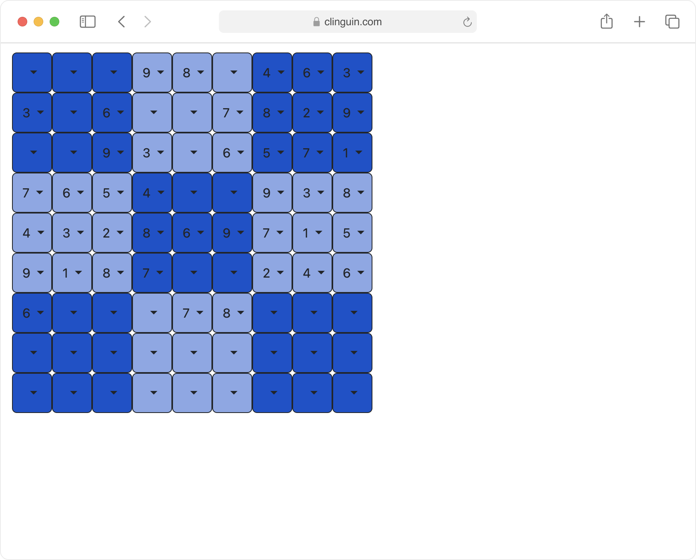

Clinguin: Building UIs in ASP
=============================

Clinguin enables ASP developers to create interactive User Interface (UI) prototypes using only ASP.
UIs are defined as sets of facts,  which are then rendered by a frontend to provide continuous interaction with ASP solvers based on user-triggered events.

- :ref:`Quick Start`: Step-by-step guide on how to use Clinguin using the sudoku.
- :ref:`Reference Guide`: Explanation of the concepts and components of Clinguin.
- :ref:`Frontends`: Elements and attributes available to create your UI.
- :ref:`Backends`: Operations and the predicates that will be available to create the UI.
- :ref:`Customization`: Create your own backend or contribute to the *Clinguin* project.
- :ref:`Examples`: To get inspiration for your UI.
- :ref:`Help`: If you are having trouble.

**Here is a motivational example:**

Consider an ASP encoding that solves the sudoku puzzle (:ref:`sudoku basic`) where cells are defined by predicate ``pos(X,Y)`` and solutions by ``sudoku(X,Y,V)``.
Clinguin will use this encoding and the UI encoding shown below to construct the following UI.

.. code-block::

   elem(window, window, root).
   attr(window, child_layout, grid).
   attr(window, class, ("justify-content-start")).

      elem(dd(X,Y), dropdown_menu, window) :- pos(X,Y).
      attr(dd(X,Y), width, 50)  :- pos(X,Y).
      attr(dd(X,Y), height, 50) :- pos(X,Y).
      attr(dd(X,Y), grid_column, X) :- pos(X,Y).
      attr(dd(X,Y), grid_row, Y) :- pos(X,Y).
      attr(dd(X,Y), class, ("border-dark";"bg-primary")) :- pos(X,Y).
      attr(dd(X,Y), class, "bg-opacity-50") :- subgrid(X,Y,S), S \= 2.
      attr(dd(X,Y), selected, V) :- _all(sudoku(X,Y, V)).

            elem(ddv(X,Y, V), dropdown_menu_item, dd(X,Y)) :- _any(sudoku(X,Y, V)).
            attr(ddv(X,Y, V), label, V) :- _any(sudoku(X,Y, V)).
            when(ddv(X,Y, V), click, call, add_assumption(sudoku(X,Y,V), true)) :- _any(sudoku(X,Y, V)).

.. note:: Clinguin is part of the `Potassco umbrella <https://potassco.org/>`_ (which is the home of Clingo and the other ASP tools)

.. toctree::
   :hidden:

   clinguin/installation
   clinguin/use
   clinguin/reference/index
   clinguin/frontends/index
   clinguin/backends/index
   clinguin/development/index
   clinguin/examples/index
   clinguin/help
