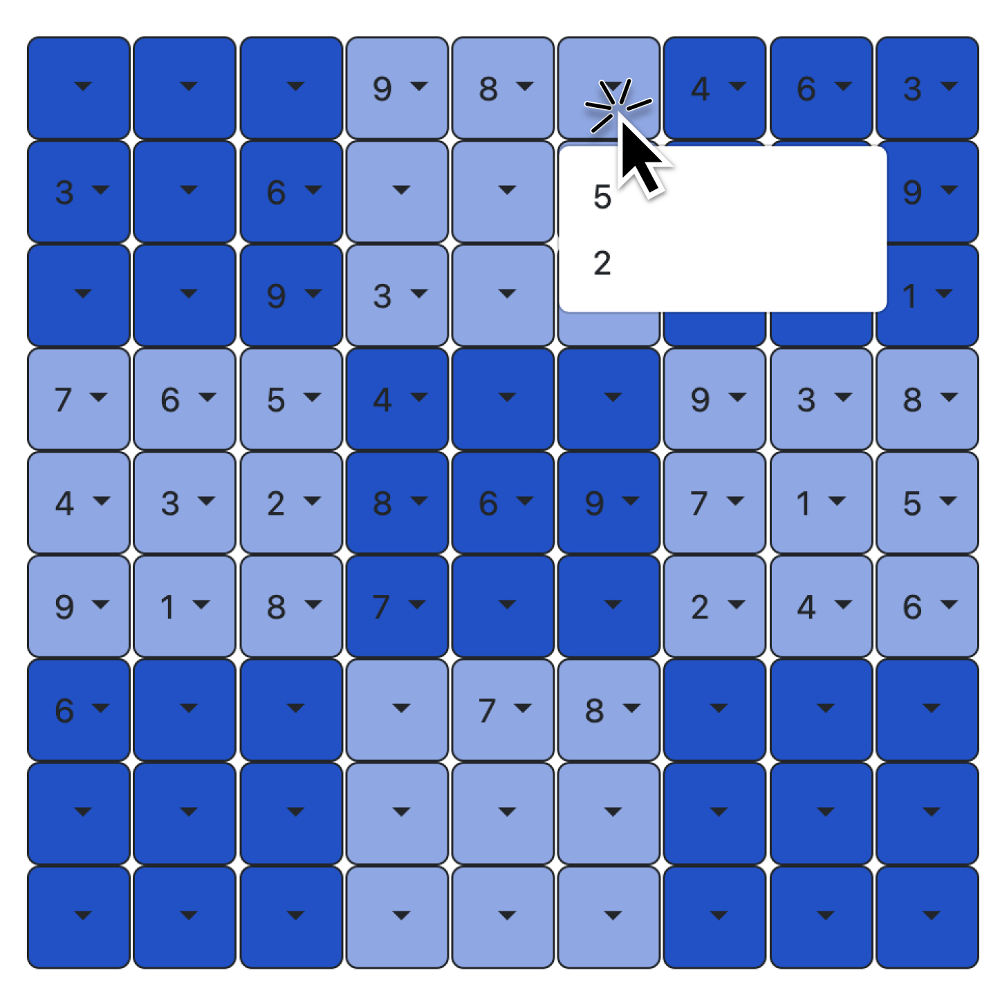
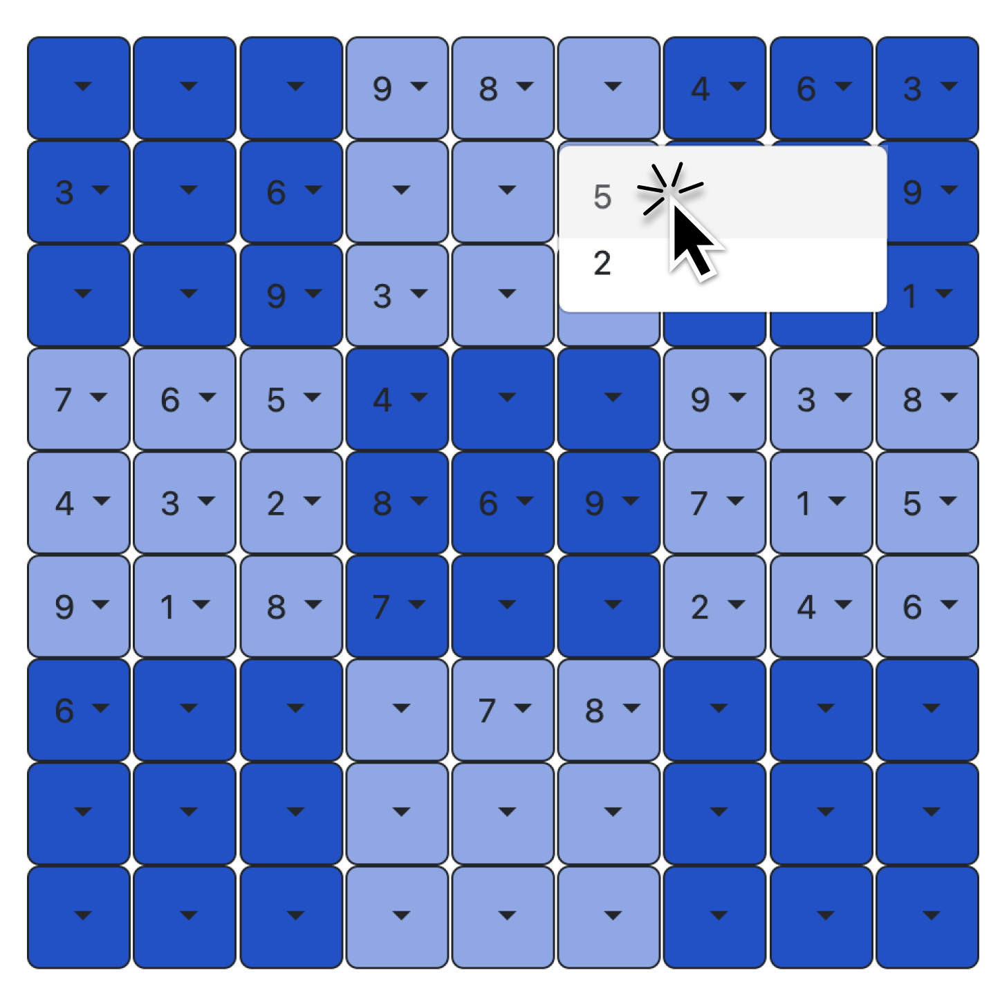
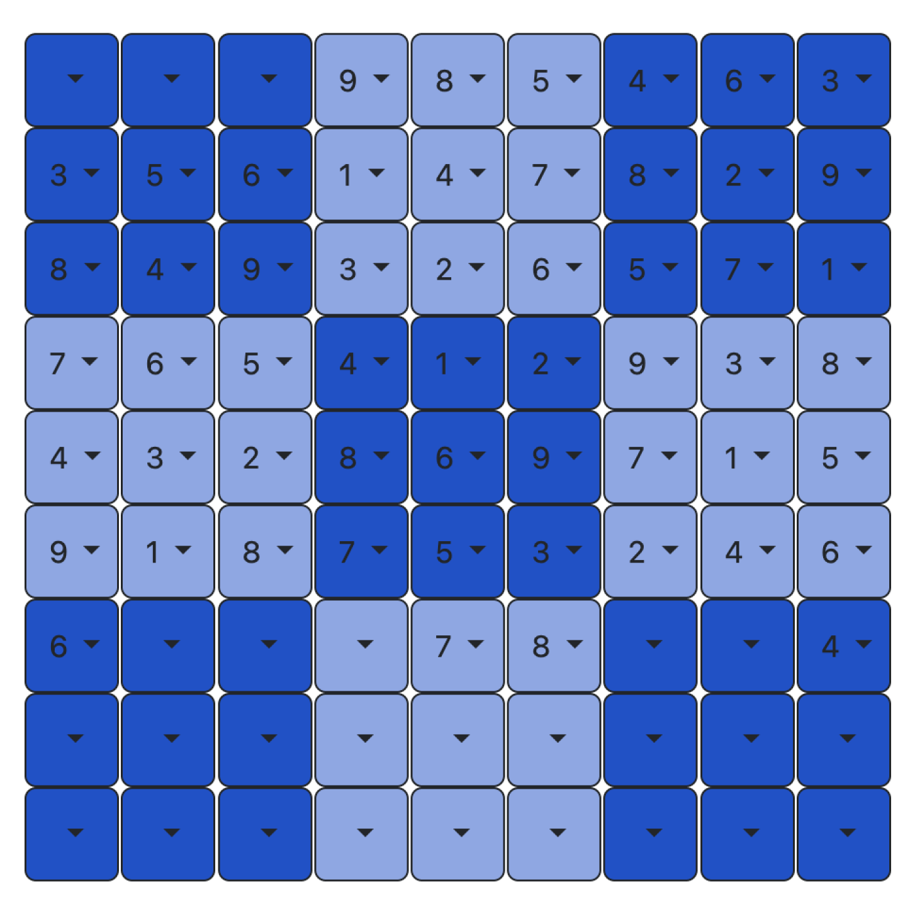

.. clinguin documentation master file,  created by
   sphinx-quickstart on Wed Aug 31 12:21:45 2022.
   You can adapt this file completely to your liking,  but it should at least
   contain the root `toctree` directive.

Clinguin: Building User Interfaces in ASP
=========================================

Clinguin enables ASP developers to create interactive User Interface (UI) prototypes using only ASP.
UIs are defined as sets of facts,  which are then rendered by a fronted to provide continuous interaction with ASP solvers based on user-triggered events.

This and more examples are available in our `examples folder <https://github.com/potassco/clinguin/tree/master/examples>`_!

**Here is a motivation example:**

Consider an ASP encoding that solves the sudoku puzzle where cells are defined by prediate  ``pos(X,Y)`` and solutions by ``sudoku(X,Y,V)``
Clinguin will use this encoding and the following ui encoding to construct the UI shown bellow.

.. code-block::
   
  elem(window, window, root).
  attr(window, child_layout, grid).

    elem(dd(X,Y), dropdown_menu, window) :- pos(X,Y).
    attr(dd(X,Y), width, 50)  :- pos(X,Y).
    attr(dd(X,Y), height, 50) :- pos(X,Y).
    attr(dd(X,Y), grid_column, X) :- pos(X,Y).
    attr(dd(X,Y), grid_row, Y) :- pos(X,Y).
    attr(dd(X,Y), class, ("border-dark";"bg-primary")) :- pos(X,Y).
    attr(dd(X,Y), class, "bg-opacity-50") :- subgrid(X,Y,S),  S\2!=0.
    attr(dd(X,Y), selected, V) :- _c(sudoku(X,Y, V)).

        elem(ddv(X,Y, V), dropdown_menu_item, dd(X,Y)) :- _b(sudoku(X,Y, V)).
        attr(ddv(X,Y, V), label, V) :- _b(sudoku(X,Y, V)).
        when(ddv(X,Y, V), click, call, add_assumption(sudoku(X,Y, V))) :- _b(sudoku(X,Y, V)).

For a more detailed explanation on how this code works take a look at the :ref:`Basic Usage` section.

.. note:: Clinguin is part the Potassco umbrella (which is the home of Clingo and the other ASP tools)

.. toctree::
   :maxdepth: 2
   :caption: Contents:

   clinguin/installation
   clinguin/use.rst
   clinguin/reference
   clinguin/frontends
   clinguin/backends

