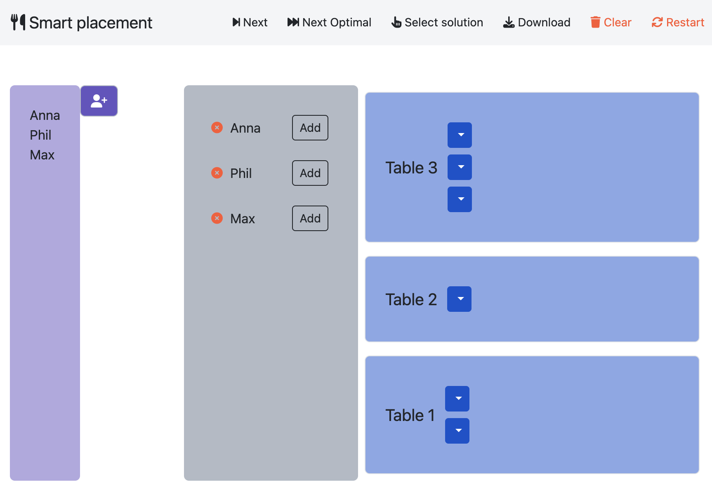
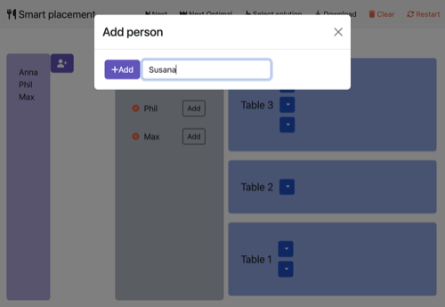
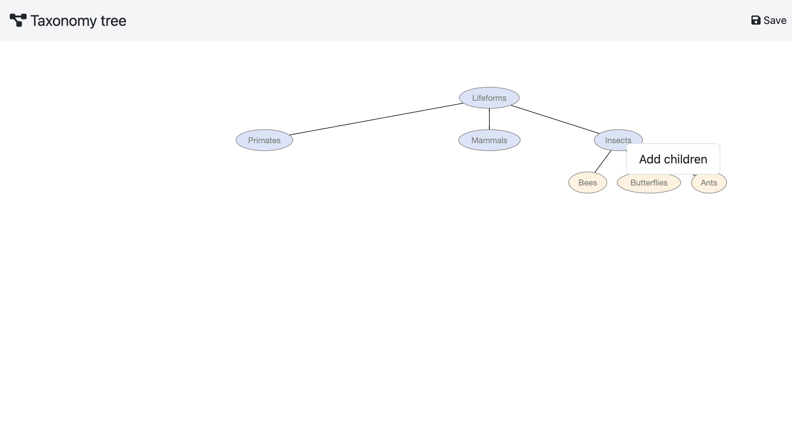
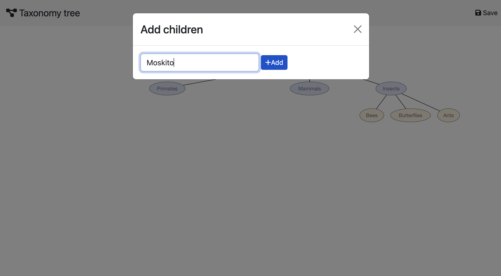

# Clinguin Examples 
Our **[examples folder](.)** shows how to use the range of functionalities in different applications. 

## [AngularFrontend](./angular)
    
An web UI made with angular and bootstrap. Make sure this fronted was installed according to the documentation before running the examples

### Multi-Shot Backend

- [angular/placement](./angular/placement)

- [angular/jobshop](./angular/jobshop)

- [angular/sudoku](./angular/sudoku)

- [angular/style](./angular/style)

### Clingraph Backend

- [angular/graph_coloring](./angular/graph_coloring)

- [angular/tree_browser](./angular/tree_browser)

- [angular/ast](./angular/ast)

### Explanation Backend

- [angular/sudoku_advanced](./angular/sudoku_advanced)

----

## [TkinterFrontend](./tkinter)
    
An OS dependent UI made by [tkinter](https://docs.python.org/3/library/tkinter.html) python interface.

### Single-Shot Backend

- [tkinter/sudoku_single_shot](./tkinter/sudoku_single_shot)

### Multi-Shot Backend

- [tkinter/housing](./tkinter/housing)

- [tkinter/sudoku](./tkinter/sudoku)

- [tkinter/study_regulations](./tkinter/study_regulations)

### Clingraph Backend

- [tkinter/graph_coloring](./tkinter/graph_coloring)

### Explanation Backend

- [tkinter/sudoku_explained](./tkinter/sudoku_explained)

