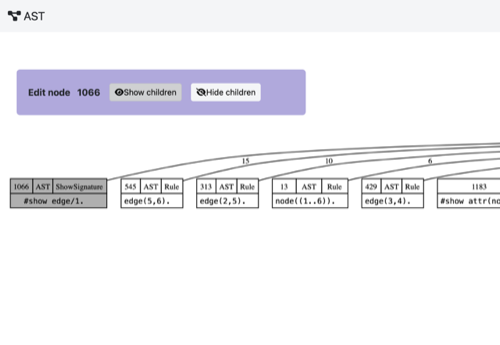
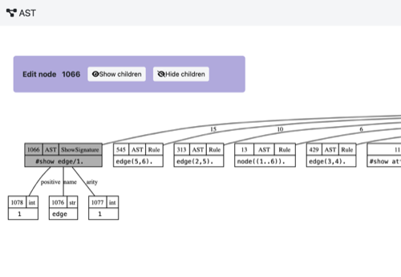

## AST

- **Backend**:   `ClingraphBackend`
- **Frontend**:   `AngularFrontend`

### Usage

```
clinguin client-server --domain-files examples/angular/ast/encoding.lp examples/angular/ast/instance.lp --ui-files examples/angular/ast/ui.lp   --backend=ClingraphBackend --clingraph-files=examples/angular/ast/viz.lp 
```



