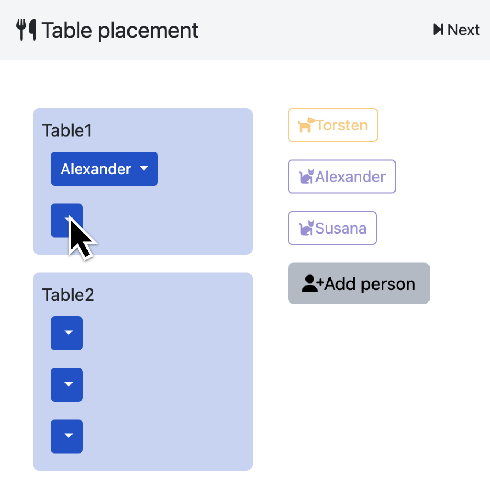
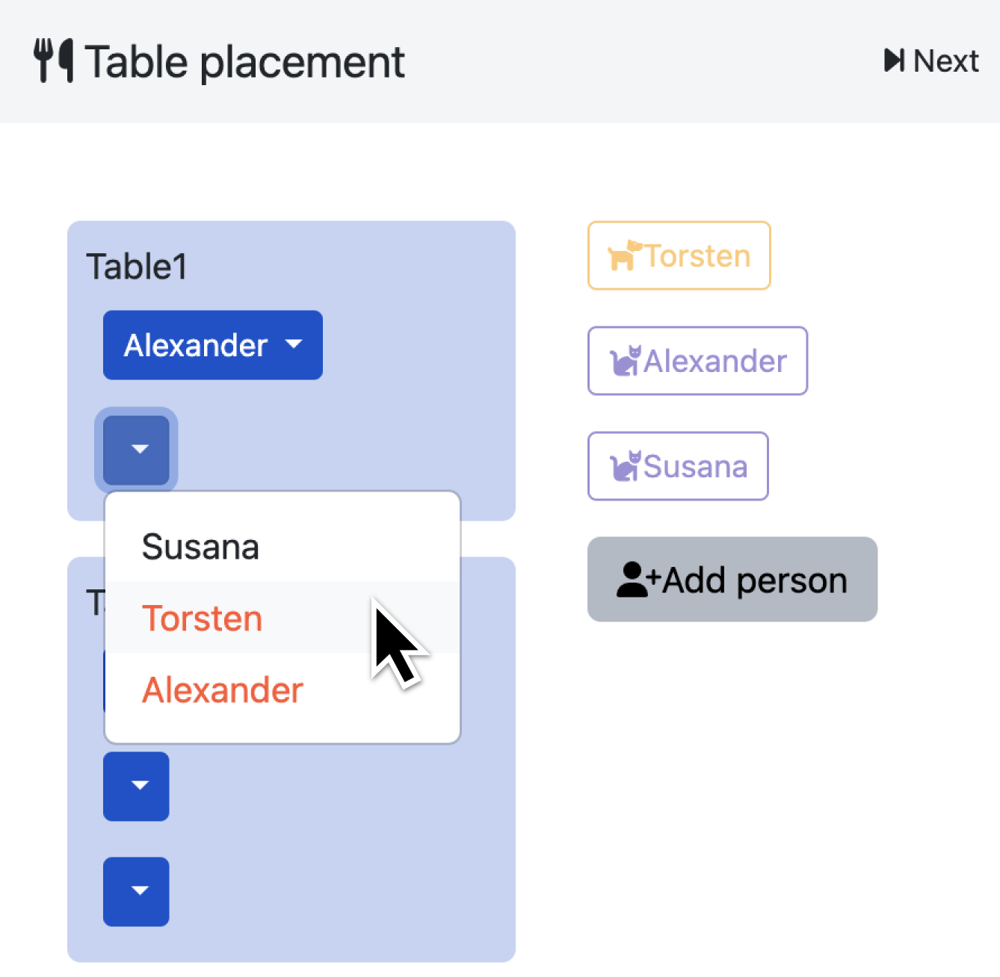
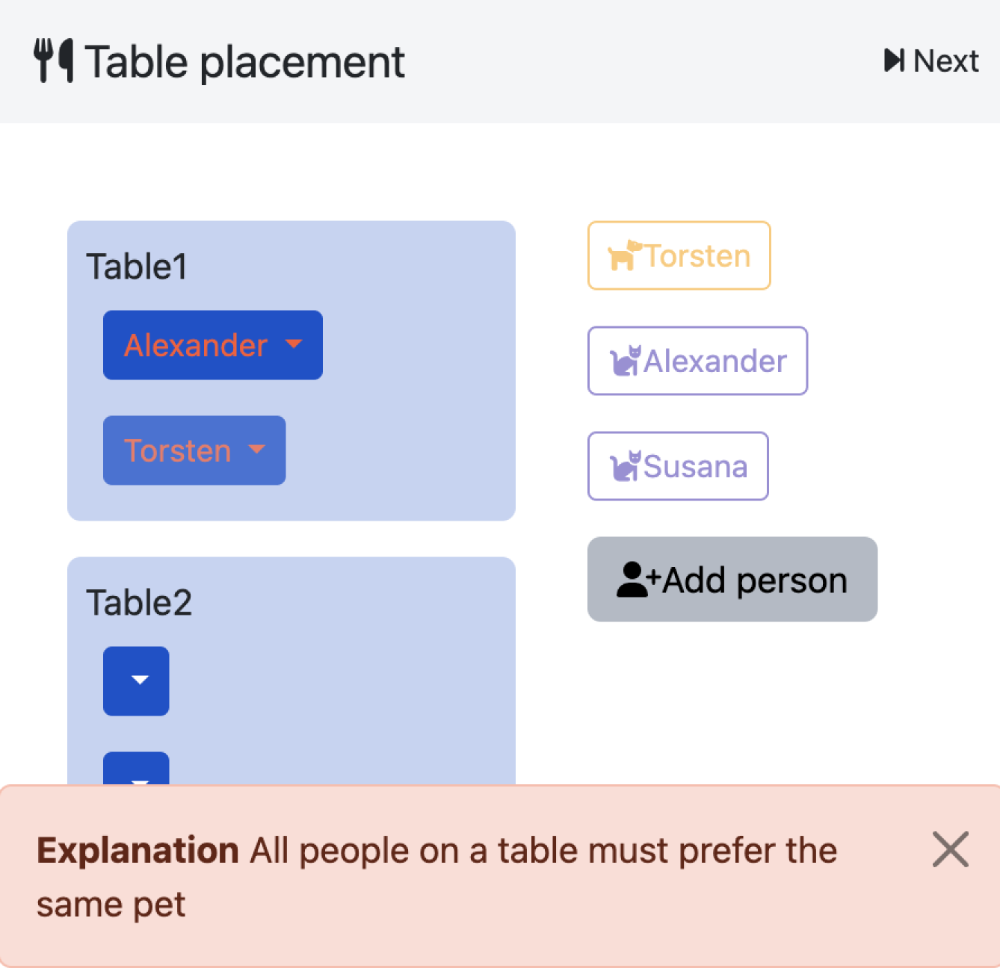

## Cat and Dog people placement

- **Backend**:   `ExplanationBackend`
- **Frontend**:   `AngularFrontend`

This example was used in the paper for clinguin in [ICLP 2024](https://www.iclp24.utdallas.edu/). The aim is to place people in tables so that no cat people are sitting with dog people.


### Usage

```
clinguin client-server --domain-files examples/angular/catdog/{instance.lp,encoding-explain.lp} --ui-files examples/angular/catdog/{ui-tables.lp,ui-menu.lp,ui-people.lp,ui-explain.lp,ui-explain-msg.lp} --backend ExplanationBackend --assumption-signature cons,2
```






