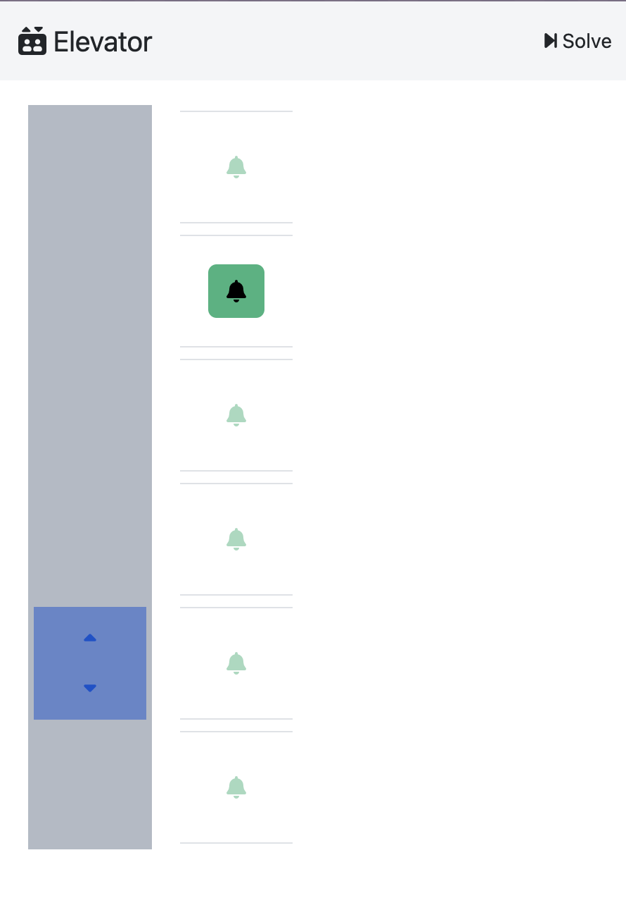
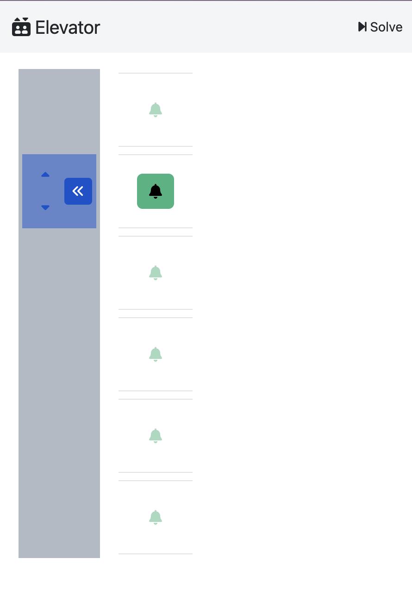
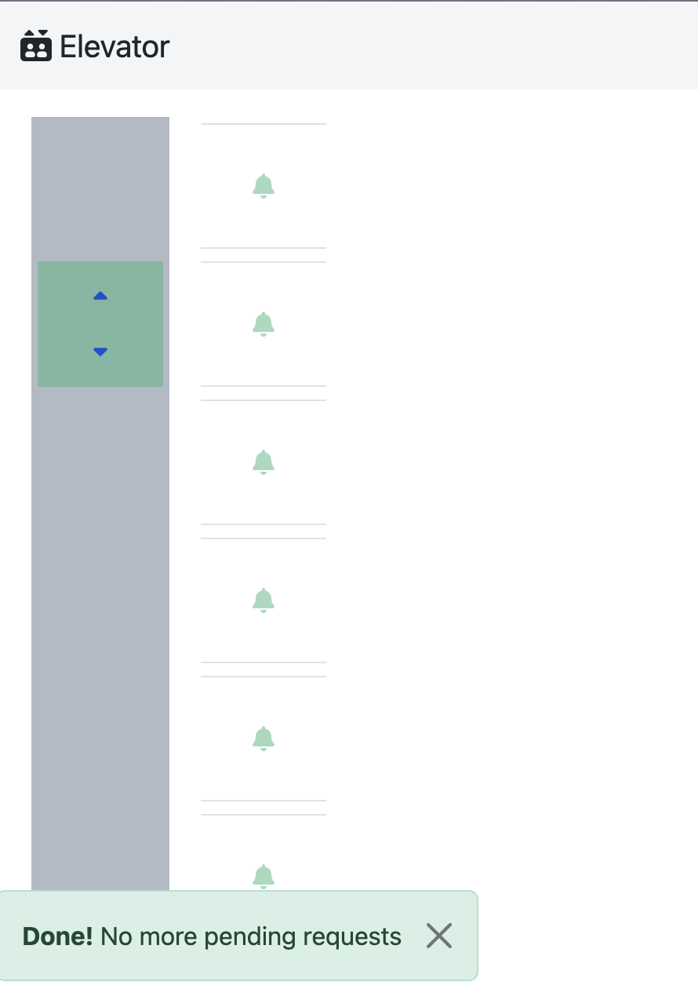

## Elevator

- **Backend**:   `ClingoBackend`
- **Frontend**:   `AngularFrontend`

This example showcases one way to use clinguin in a multi-shot encoding.
In this case we use a planning problem and use incremental solving.


### Usage

```
clinguin client-server --domain-files examples/angular/elevator/encoding.lp examples/angular/elevator/instance.lp --ui-files examples/angular/elevator/ui.lp  --server-log-level DEBUG
```


<!-- 

 -->

