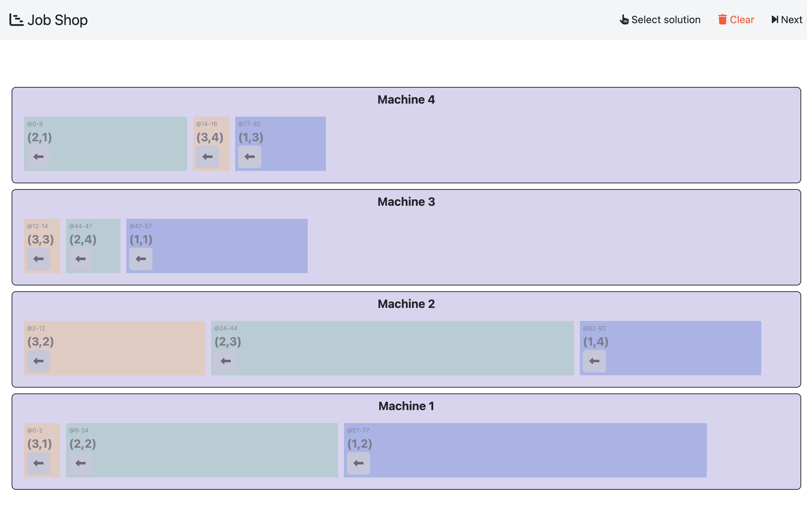

## Placement

- **Backend**:   `ClingoDLBackend`
- **Frontend**:   `AngularFrontend`

### Usage

```
clinguin client-server --frontend AngularFrontend --domain-files examples/angular/jobshop/encoding.lp  examples/angular/jobshop/instance.lp --ui-files examples/angular/jobshop/ui.lp  --backend ClingoDLBackend 
```


