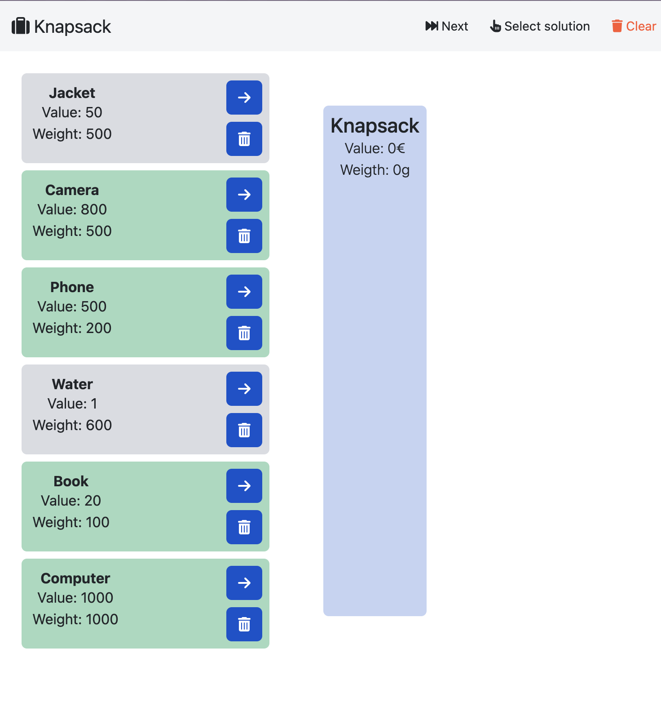
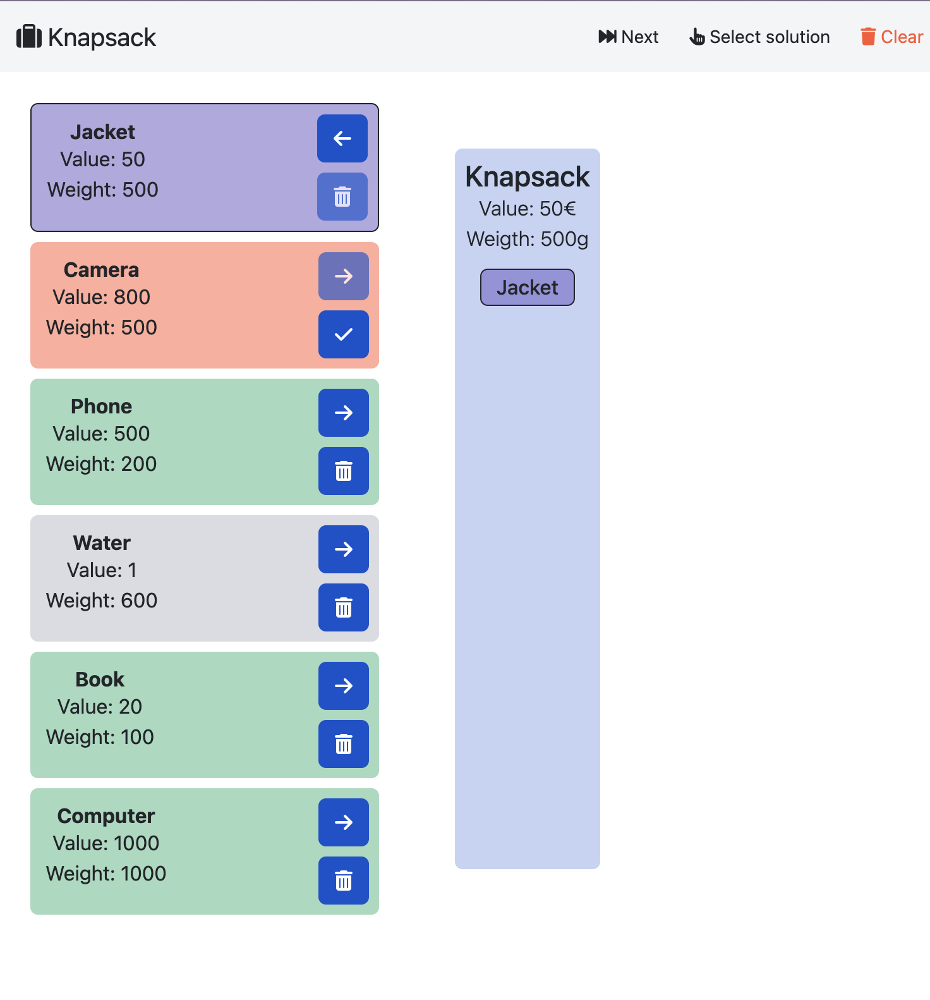
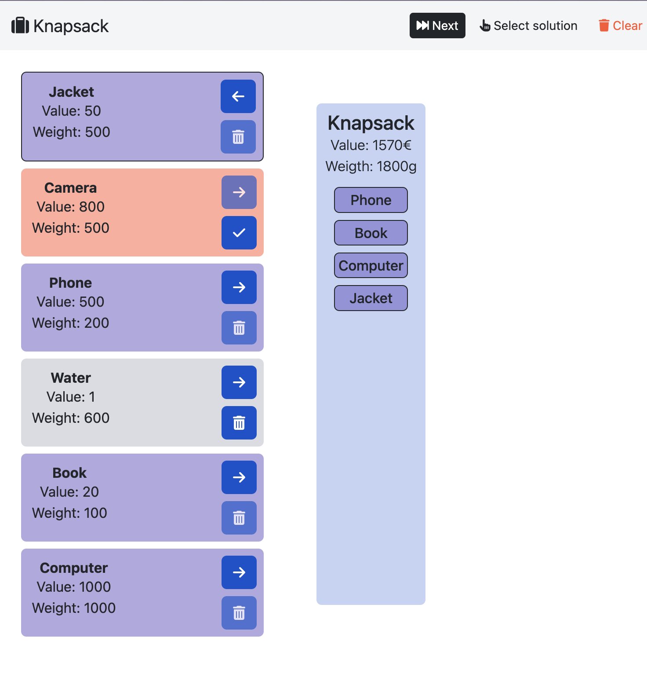

## Knapsack

- **Backend**:   `ClingoBackend`
- **Frontend**:   `AngularFrontend`

Solves the [Knapsack problem](https://developers.google.com/optimization/pack/knapsack#:~:text=In%20the%20knapsack%20problem%2C%20you,can't%20pack%20them%20all.).
By doing so, it showcases the use of optimal consequences and false assumptions.


### Usage

```
clinguin client-server --domain-files examples/angular/knapsack/encoding.lp examples/angular/knapsack/instance.lp --ui-files examples/angular/knapsack/ui.lp
```




