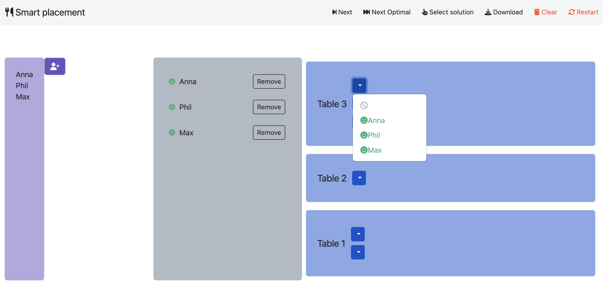
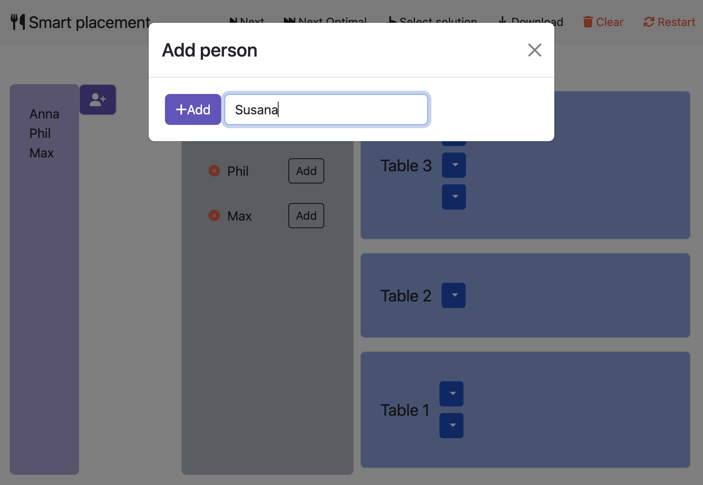
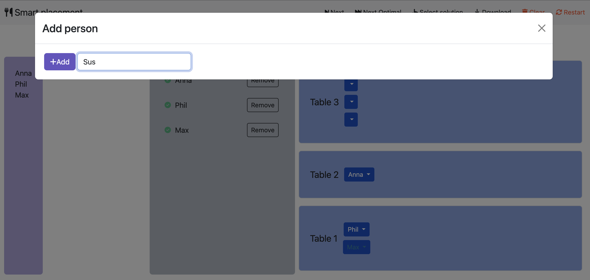

## Placement

- **Backend**:   `ClingoMultishotBackend`
- **Frontend**:   `AngularFrontend`

This example show how to use consequences with optimization statements to have user feedback on optimal models.


### Usage

```
clinguin client-server --domain-files examples/angular/placement_optimized/instance.lp examples/angular/placement_optimized/encoding.lp --ui-files examples/angular/placement_optimized/ui.lp
```




