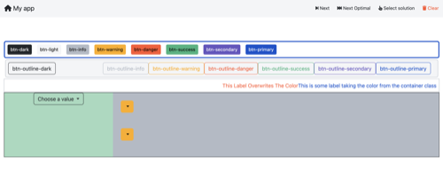

## Placement

- **Backend**:   `ClingoMultishotBackend`
- **Frontend**:   `AngularFrontend`

Showcases multiple style options from bootstrap

### Usage

```
clinguin client-server --frontend AngularFrontend --domain-files examples/angular/style/encoding.lp --ui-files examples/angular/style/ui.lp
```


