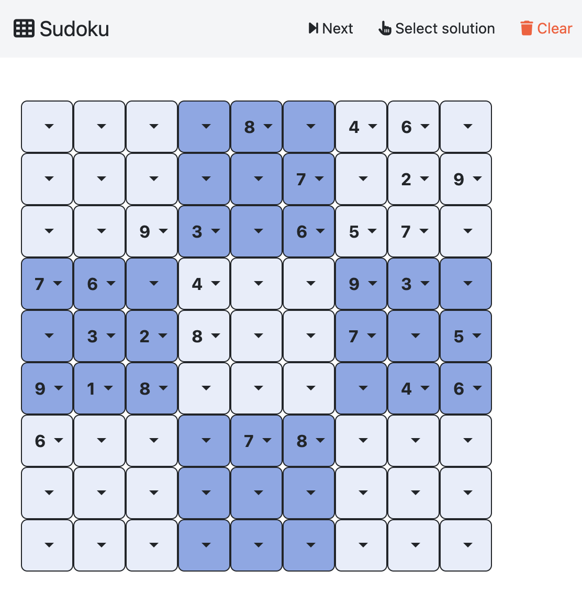
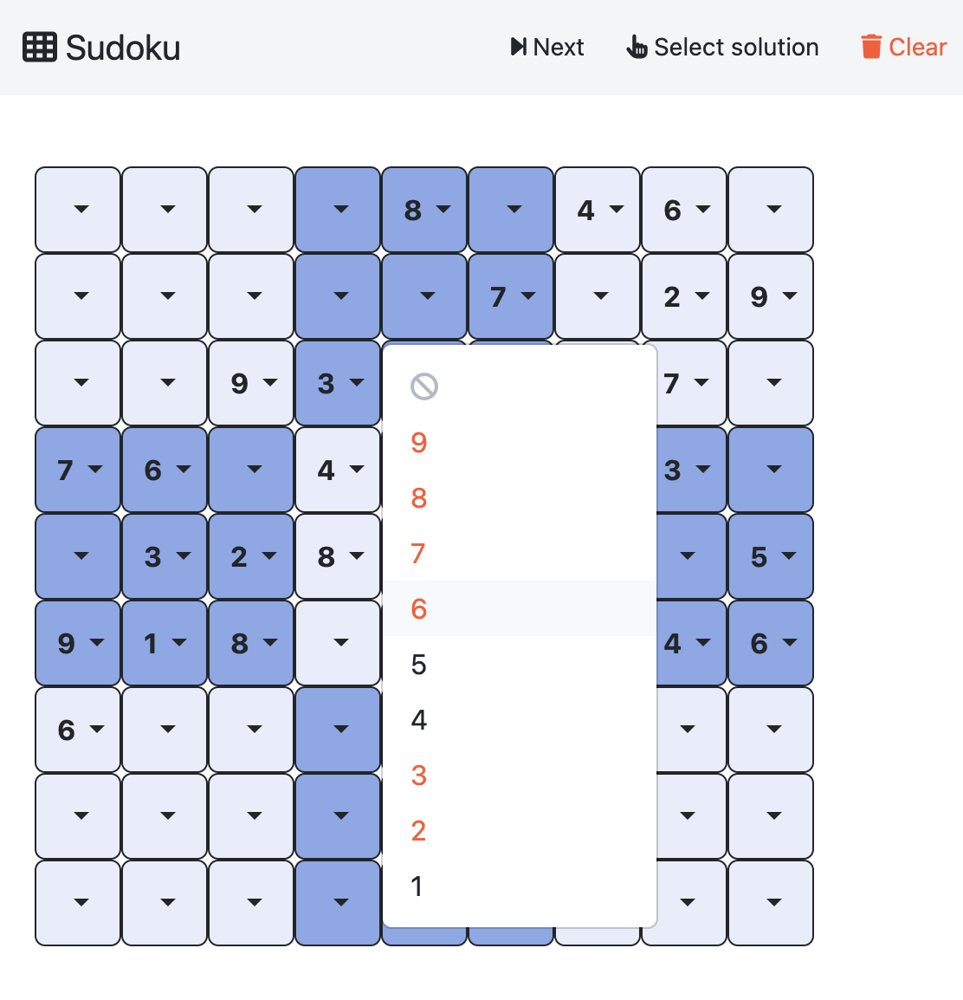

## Sudoku

- **Backend**:   `ExplanationBackend`
- **Frontend**:   `AngularFrontend`

An advanced version of the sudoku where all values are listed as possibilities but when an invalid one is chosen, the explanation is highlighted.

Notice that the instances uses choices on predicate `initial/3`. This way they can be used as assumptions and be included in the `_clinguin_muc` predicate by the `ExplanationBackend`. The option `--assumption-signature initial,3` adds all these atoms as true assumptions.

### Usage

```
clinguin client-server --frontend AngularFrontend --domain-files examples/angular/sudoku_advanced/instance.lp examples/angular/sudoku_advanced/encoding.lp --ui-files examples/angular/sudoku_advanced/ui.lp --backend ExplanationBackend  --assumption-signature initial,3
```




