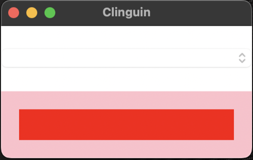
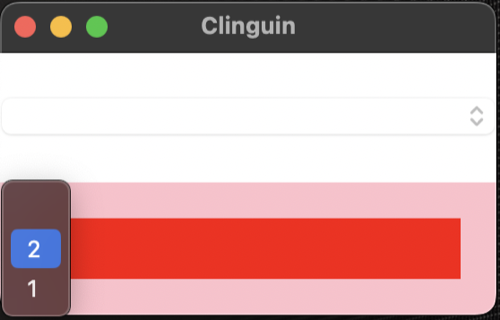
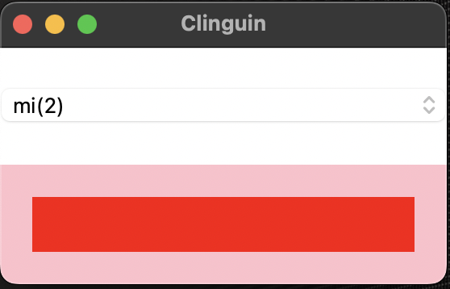

## Test 01

- **Backend**:   `ClingoBackend`
- **Frontend**:   `TkinterFrontend`

### Usage

```
clinguin client-server --domain-files examples/test/test_01/domain_file.lp --ui-files examples/test/test_01/ui.lp
```





*Output style might vary depending on the OS (Shown screenshots were rendered in MacO)s*

