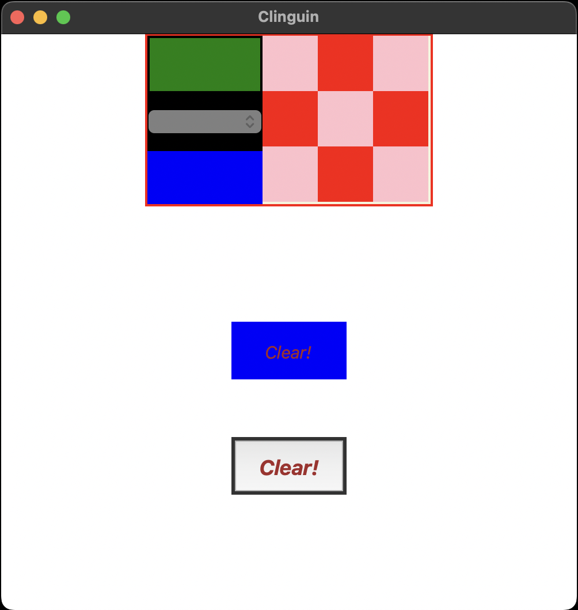

## Test 03

- **Backend**:   `ClingoMultishotBackend`
- **Frontend**:   `TkinterFrontend`

### Usage

```
clinguin client-server --domain-files examples/test/test_03/domain_file.lp --ui-files examples/test/test_03/ui.lp
```



*Output style might vary depending on the OS (Shown screenshots were rendered in MacO)s*
