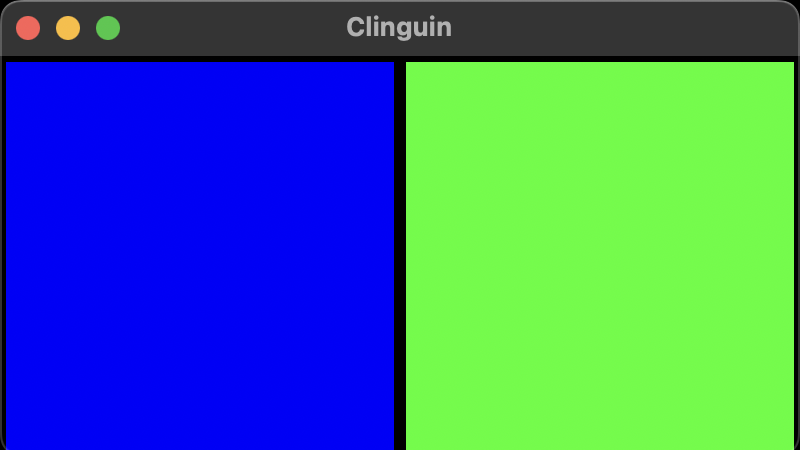

## Test 06

- **Backend**:   `ClingoBackend`
- **Frontend**:   `TkinterFrontend`

### Usage

All of the following commands should look approximately the same


```
clinguin client-server --domain-files examples/test/test_06/domain_file.lp --ui-files examples/test/test_06/ui_abs_static.lp
```

```
clinguin client-server --domain-files examples/test/test_06/domain_file.lp --ui-files examples/test/test_06/ui_rel_static.lp
```



*Output style might vary depending on the OS (Shown screenshots were rendered in MacO)s*

