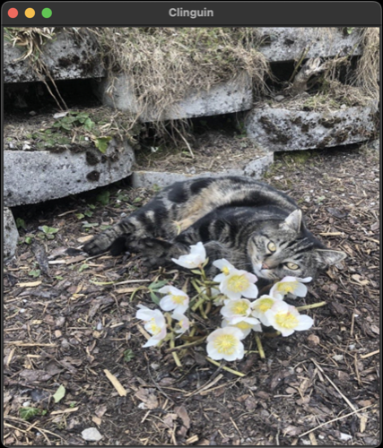

## Test 07

- **Backend**:   `ClingoMultishotBackend`
- **Frontend**:   `TkinterFrontend`

Loads an image in the UI. Note that tkinter loads the image from the path in this configuration, therefore client and server must have access to local files

Image license (tommi.jpg): CC-BY-SA - Image taken by Alexander Beiser.

### Usage

```
clinguin client-server --domain-files examples/test/test_07/domain_file.lp --ui-files examples/test/test_07/ui.lp
```



*Output style might vary depending on the OS (Shown screenshots were rendered in MacO)s*
