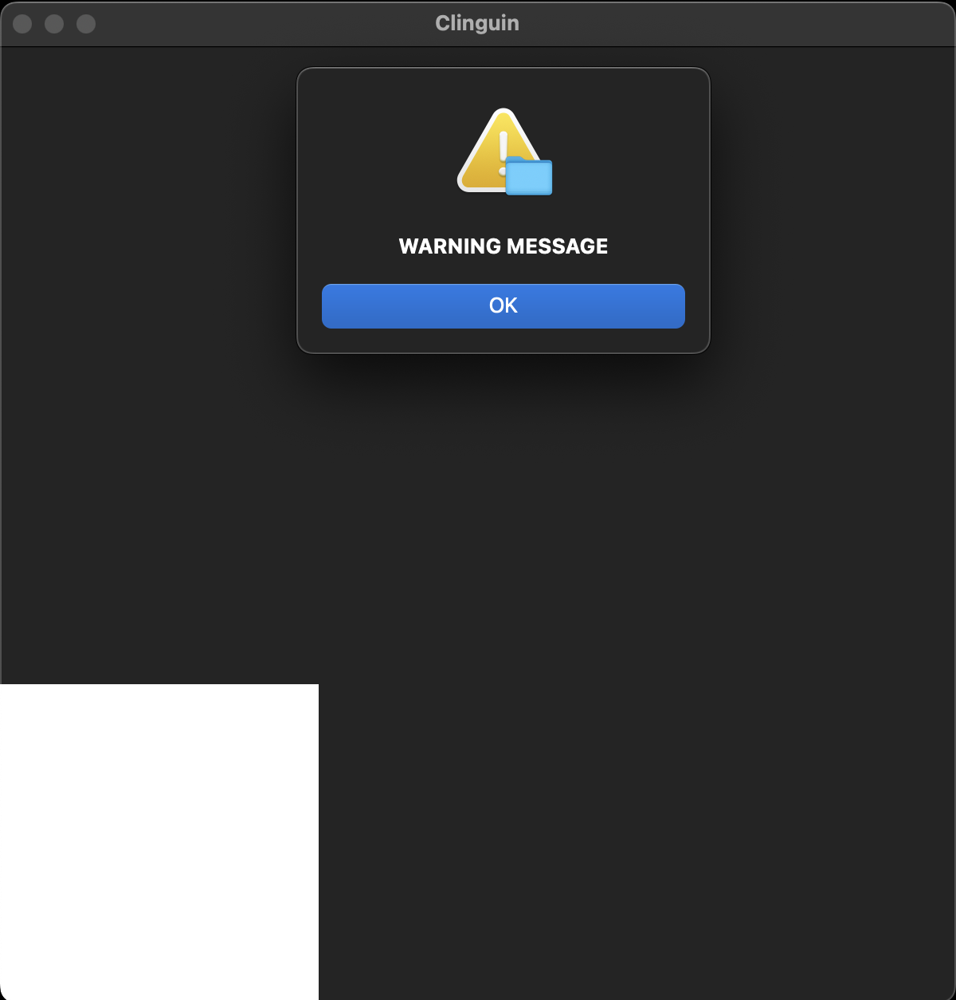
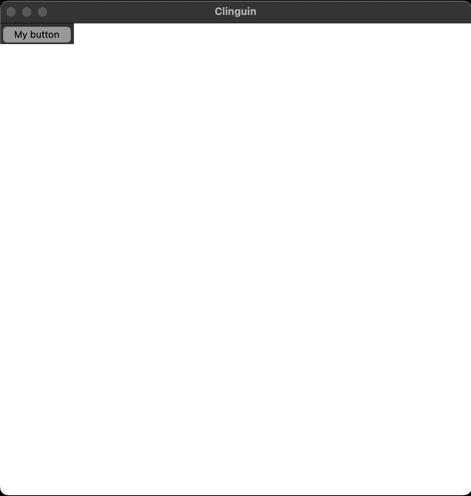

## Test 08

- **Backend**:   `ClingoBackend`
- **Frontend**:   `TkinterFrontend`

This example is supposed to open several alerts in the system.

### Usage

```
clinguin client-server --domain-files examples/test/test_08/domain_file.lp --ui-files examples/test/test_08/ui.lp
```




*Output style might vary depending on the OS (Shown screenshots were rendered in MacO)s*
