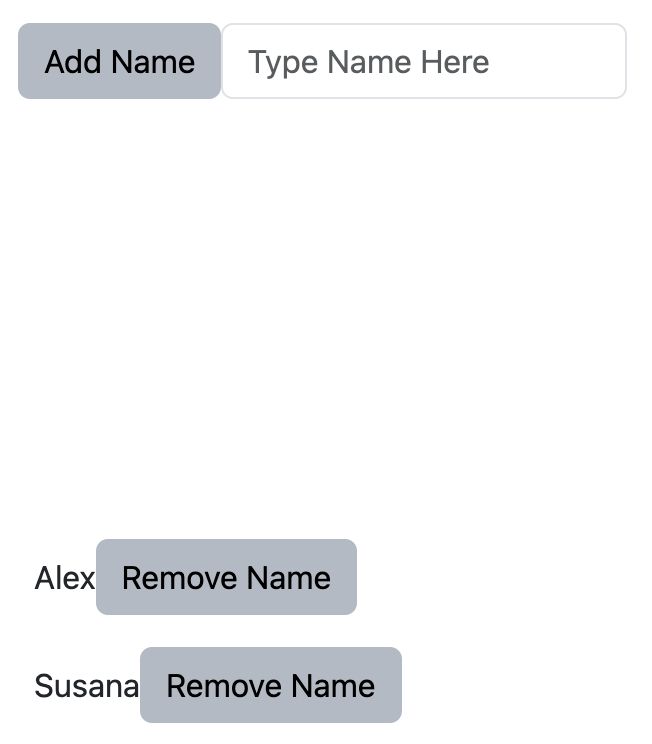

## Test 12

- **Backend**:   `ClingoMultishotBackend`
- **Frontend**:   `Angular`

### Usage

```
clinguin client-server --domain-files examples/test/test_12/domain_file.lp --ui-files examples/test/test_12/ui.lp
```


