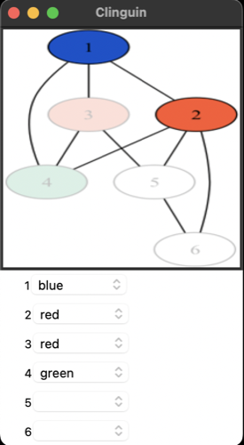

## Graph coloring

- **Backend**:   `ClingraphBackend`
- **Frontend**:   `TkinterFrontend`

Clingraph encodings are provided in the command line. Notice that the intermediate format option is necessary for Tkinter

### Usage

```
clinguin client-server --domain-files examples/tkinter/graph_coloring/encoding.lp --ui-files examples/tkinter/graph_coloring/ui.lp  --backend=ClingraphBackend --clingraph-files=examples/tkinter/graph_coloring/viz.lp --intermediate-format png
```



*Output style might vary depending on the OS (Shown screenshots were rendered in MacO)s*

