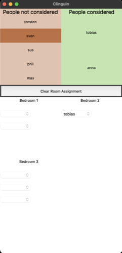

## Housing

- **Backend**:   `ClingoMultishotBackend`
- **Frontend**:   `TkinterFrontend`

You must select the people and then divide into rooms.
Includes the option to browse optimal solutions in order.

### Usage

```
clinguin client-server --domain-files examples/tkinter/housing/instance.lp examples/tkinter/housing/encoding.lp --ui-files examples/tkinter/housing/ui.lp --frontend=TkinterFrontend
```



*Output style might vary depending on the OS (Shown screenshots were rendered in MacO)s*


