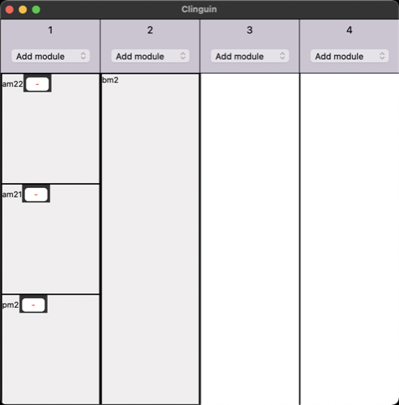

## Study regulations

- **Backend**:   `ClingoMultishotBackend`
- **Frontend**:   `TkinterFrontend`

Create a study plan.

These encoding was presented in the article [1]

### Usage

```
clinguin client-server --domain-files examples/tkinter/study_regulations/instance.lp examples/tkinter/study_regulations/encoding.lp -c n=4 --ui-files examples/tkinter/study_regulations/ui.lp --frontend=TkinterFrontend
```



*Output style might vary depending on the OS (Shown screenshots were rendered in MacO)s*

[1] Hahn, S., Martens, C., Nemes, A., Otunuya, H., Romero, J., Schaub, T., & Schellhorn, S. (2023). Reasoning about Study Regulations in Answer Set Programming (Preliminary Report). In ICLP Workshops (Vol. 3437)