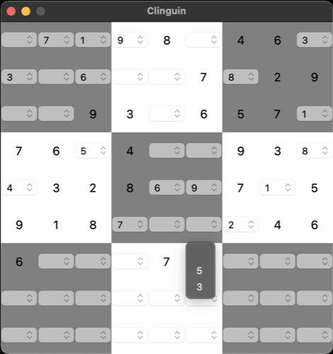

## Sudoku

- **Backend**:   `ClingoBackend`
- **Frontend**:   `TkinterFrontend`

### Usage

```
clinguin client-server --domain-files examples/tkinter/sudoku/instance.lp examples/tkinter/sudoku/encoding.lp --ui-files examples/tkinter/sudoku/ui.lp --frontend=TkinterFrontend
```



*Output style might vary depending on the OS (Shown screenshots were rendered in MacO)s*

