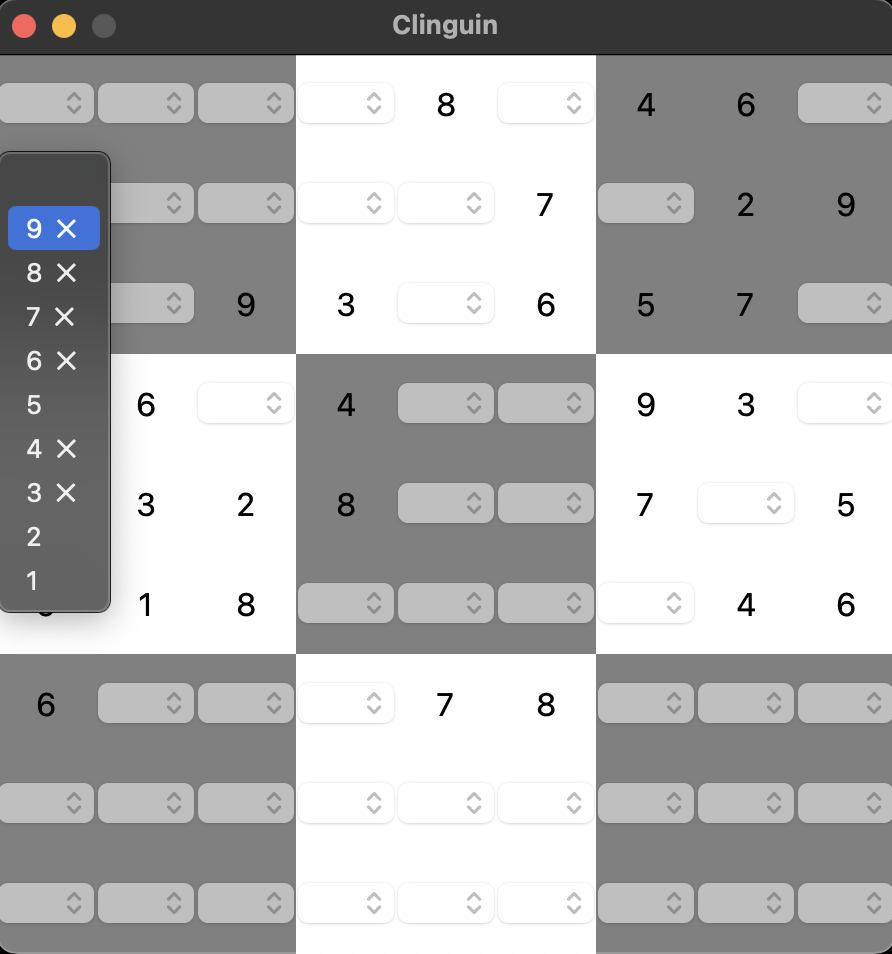

## Sudoku explanied

- **Backend**:   `ExplanationBackend`
- **Frontend**:   `TkinterFrontend`

Same sudoku but gives as options in the dropdown even those that lead to UNSAT.
If the user selects one of there options, then the Unsat Core will light up to show why this is not available.
The `ignore-unsat-msg` flag is necessary to exclude the usual way of handling UNSAT outputs via a pop-up message to the user.

### Usage

```
clinguin client-server --domain-files examples/tkinter/sudoku_explained/instance.lp examples/tkinter/sudoku_explained/encoding.lp --ui-files examples/tkinter/sudoku_explained/ui.lp --assumption-signature=initial,3 --backend ExplanationBackend --frontend=TkinterFrontend
```




*Output style might vary depending on the OS (Shown screenshots were rendered in MacO)s*