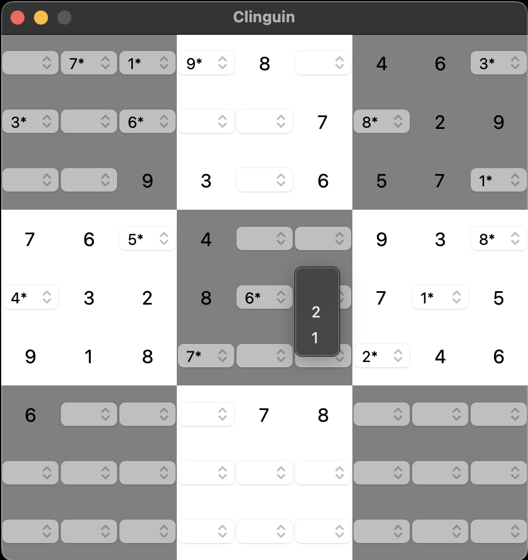

## Sudoku single shot

- **Backend**:   `ClingoBackend`
- **Frontend**:   `TkinterFrontend`

Uses a single shot backend where instead of using assumptions, the server calls will add new atoms and ground again.

The values that are inferred by the solver have a `*` appended.
Those that are part of a browsing solution are extended with `+`.

### Usage

```
clinguin client-server --domain-files examples/tkinter/sudoku_single_shot/instance.lp examples/tkinter/sudoku_single_shot/encoding.lp --ui-files examples/tkinter/sudoku_single_shot/ui.lp --backend=ClingoBackend
```




*Output style might vary depending on the OS (Shown screenshots were rendered in MacO)s*
